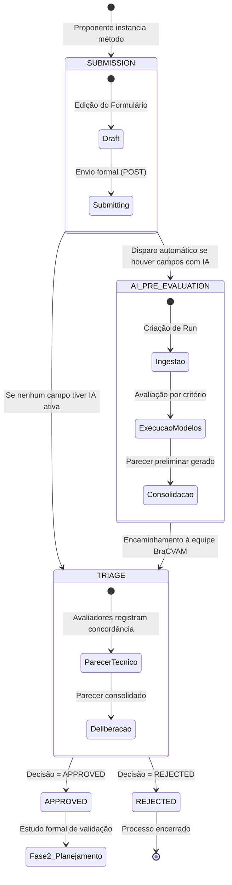

# Ciclo de Vida do Processo e Máquina de Estados

Cada método científico submetido à validação no BraCVAM é gerido na PIVMA como uma **Instância de Processo** (`ProcessInstance`). O avanço ocorre por uma máquina de estados finita estritamente controlada pelo motor de processos do backend (`process_engine.py`).

---

## 🔄 Fluxograma do Ciclo de Vida

---

## 📌 Descrição dos Estados

### 1. `SUBMISSION` (Submissão e Edição de Rascunho)
- **Ator principal**: Proponente do método.
- **Ações permitidas**:
  - Salvar rascunho completo via `PUT /processes/{id}/forms/{key}`.
  - Atualização parcial de campos via `PATCH /processes/{id}/forms/{key}`.
  - Upload e exclusão de documentos comprobatórios (POPs, artigos) via `POST /processes/{id}/attachments`.
  - Exclusão lógica suave (*soft-delete*) do processo caso desista da proposta.
- **Transição de saída**: Quando o proponente submete formalmente a proposta via `POST /processes/{id}/forms/{key}/submit`.

### 2. `AI_PRE_EVALUATION` (Esteira Assíncrona de IA Assistiva)
- **Ator principal**: Motor de IA (LangChain / OpenAI / Modelos Locais).
- **Comportamento**: Se o formulário possui campos com `ai_evaluation_enabled = true`, o envio gera uma esteira de avaliação assíncrona.
- **Garantia de Governança**: A IA nunca decide, apenas gera recomendações preliminares por critério científico para apoiar o parecer humano.

### 3. `TRIAGE` (Triagem Técnica e Decisão BraCVAM)
- **Ator principal**: Equipe BraCVAM e Avaliadores Técnicos.
- **Ações permitidas**:
  - Inspecionar a proposta e comparar os dados com o parecer gerado pela IA.
  - Registrar parecer técnico campo a campo (Concorda, Discorda Parcialmente, Discorda Totalmente).
  - Deliberar a decisão final via `POST /triage/decision` com justificativa formal.

### 4. `APPROVED` / `REJECTED` (Decisão Final da Fase 1)
- `APPROVED`: O método candidato atende aos critérios científicos de elegibilidade e avança para a Fase 2 (Planejamento e Formação do Comitê de Validação).
- `REJECTED`: O dossiê é encerrado com justificativa técnica registrada para o proponente.
