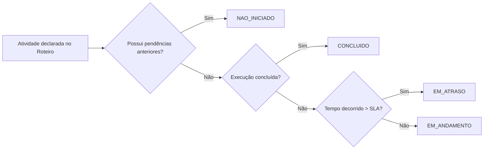

# Painel de Pendências e Agregação Kanban

O Painel de Pendências da PIVMA (desenvolvido sob a **Spec 018**) é uma capacidade central de governança que permite a gestores e participantes acompanharem o status de dezenas ou centenas de atividades distribuídas por múltiplos métodos de validação simultâneos sem precisar inspecionar processo por processo.

---

## 🏛️ O Conceito: Backend Agregador vs Interface de Frontend

* **No Backend**: O endpoint `GET /activities/kanban` consolida atividades, calcula prazos de SLA, verifica dependências bloqueantes e aplica regras de visibilidade baseadas no perfil do usuário conectado.
* **No Frontend**: A aplicação consome este endpoint e pode renderizar os dados em múltiplos formatos:
  1. **Quadro Kanban tradicional** (4 colunas com contadores e cartões).
  2. **Tabela / Lista de Tarefas** ("Minhas Pendências").
  3. **Widgets de Visão Geral** em painéis executivos.

---

## 📡 Contrato da API: `GET /activities/kanban`

```http
GET /activities/kanban?column=EM_ANDAMENTO&page=1&size=50
```

### Parâmetros de Consulta (*Query Parameters*)

| Parâmetro | Tipo | Obrigatório | Descrição |
| :--- | :--- | :--- | :--- |
| `column` | String enum | Não | Filtra itens de uma coluna específica: `NAO_INICIADO`, `EM_ANDAMENTO`, `EM_ATRASO`, `CONCLUIDO`. Se omitido, retorna atividades de todas as colunas. |
| `process_id` | UUID | Não | Restringe a consulta às atividades de uma única validação. |
| `page` | Inteiro | Não (padrão `1`) | Número da página para paginação. |
| `size` | Inteiro | Não (padrão `50`, máx `200`) | Quantidade de itens por página (essencial para usuários BraCVAM com centenas de métodos). |

---

## 📊 Regras de Distribuição das Colunas

Cada atividade (`ActivityInstance`) é mapeada pelo backend em exatamente uma das quatro colunas:



1. **`NAO_INICIADO`**: Atividades com dependências anteriores não satisfeitas (bloqueadas pelo fluxo). A resposta inclui `blocked_reason` e `blocking_activity_key`.
2. **`EM_ANDAMENTO`**: Atividades abertas aguardando ação de alguém.
3. **`EM_ATRASO`**: Atividades em andamento cujo tempo de execução (`run_started_at`) ultrapassou as horas parametrizadas no SLA (`sla_hours`).
4. **`CONCLUIDO`**: Atividades formalmente finalizadas.

---

## 📦 Exemplo de Resposta JSON

```json
{
  "items": [
    {
      "activity_id": "8a32d184-7a1b-4d92-8051-1b94d1840001",
      "activity_key": "triage_evaluation",
      "activity_name": "Triagem e Decisão BraCVAM",
      "column": "EM_ANDAMENTO",
      "cargo": "bracvam",
      "process": {
        "id": "f47ac10b-58cc-4372-a567-0e02b2c3d479",
        "code": "VAL-2026-9f8a",
        "title": "[DEMO 1] Método Pré-Validado",
        "template_key": "pre_validated_method"
      },
      "blocked_reason": null,
      "blocking_activity_key": null,
      "run_started_at": "2026-09-15T10:00:00Z",
      "sla_hours": 120,
      "completed_at": null
    }
  ],
  "total": 6,
  "page": 1,
  "size": 50,
  "counts_by_column": {
    "NAO_INICIADO": 2,
    "EM_ANDAMENTO": 2,
    "EM_ATRASO": 1,
    "CONCLUIDO": 1
  }
}
```

> [!TIP]
> **Dica para o Frontend**: O campo `counts_by_column` retorna a contagem total de cada coluna **antes da paginação**. Você pode renderizar os números dos cabeçalhos das 4 colunas em uma única chamada de API, sem precisar fazer 4 requisições separadas!

---

## 🖥️ Implementação de Referência

A pasta [`demos/kanban/`](../frontend-recipes/demos-as-reference.md) contém uma implementação de referência funcional em JavaScript vanilla que consome este endpoint.

Para testar visualmente:
1. Carregue os dados: `uv run python -m scripts.seeds --profile dev`
2. Abra: [http://localhost:8000/demos/kanban/](http://localhost:8000/demos/kanban/)
3. Entre com a conta `kanban_demo_padrao_a` (para ver cargos cruzados) ou `admin` (para ver todos os métodos).
