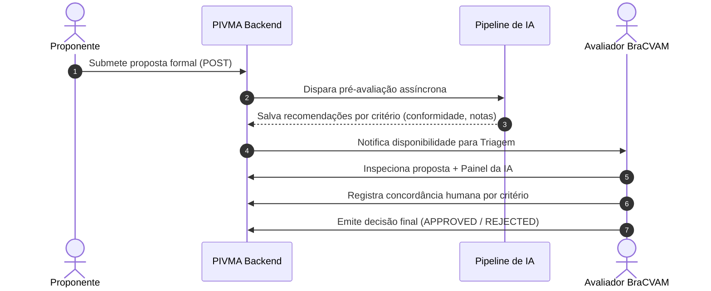

# Triagem Técnica e IA Assistiva

A triagem técnica é a etapa em que o BraCVAM analisa a admissibilidade científica e regulatória de um método submetido, deliberando se ele deve avançar para o estudo formal de validação (Fase 2).

---

## 🤖 Papel da IA: Apoio Assistivo, Nunca Deliberação

A arquitetura da PIVMA segue a premissa inegociável de que **modelos de inteligência artificial nunca tomam decisões de aprovação ou rejeição**. A IA atua estritamente como um assistente de leitura técnica:



---

## 🔍 Endpoints Principais do Módulo

### 1. Inspecionar Avaliação da IA
```http
GET /ai/evaluations/process/{process_id}
```
Retorna os itens avaliados pela esteira de IA:
- `score`: Índice de aderência (0.0 a 1.0).
- `summary`: Resumo dos pontos fortes e lacunas do dossiê.
- `criteria_results`: Lista de critérios avaliados (ex: conformidade OCDE, escopo de aplicação) com justificativas geradas pelo modelo.

### 2. Registrar Parecer Técnico por Critério
```http
POST /triage/{process_id}/feedback
```
Permite ao avaliador registrar sua concordância com a pré-avaliação da IA:
- `criterion_id`: Identificador do critério.
- `agreement_level`: `AGREE`, `PARTIALLY_AGREE`, `DISAGREE`.
- `evaluator_notes`: Comentário técnico explicativo do avaliador.

### 3. Decisão Final da Triagem
```http
POST /triage/{process_id}/decision
```
- `outcome`: `APPROVED` ou `REJECTED`.
- `justification`: Justificativa formal registrada nos logs de auditoria permanente.
