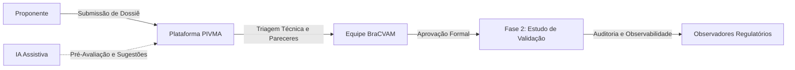

# PIVMA — Plataforma Integrada de Validação de Métodos Alternativos

Bem-vindo à documentação técnica oficial da **PIVMA** (*Plataforma Integrada de Validação de Métodos Alternativos*), desenvolvida em parceria com o **BraCVAM** (*Centro Brasileiro para Validação de Métodos Alternativos*) e a **Fiocruz**.

---

## 🎯 Missão e Propósito Científico

A PIVMA é a esteira digital que viabiliza, audita e governa o processo de validação de métodos científicos alternativos ao uso de animais no Brasil (Princípio dos 3Rs: *Replacement, Reduction, Refinement*). 

A plataforma conecta:
- **Proponentes** (laboratórios e pesquisadores submetendo métodos candidatos).
- **Equipe BraCVAM** (conduzindo triagem inicial, governança técnica e formação do comitê).
- **Avaliadores Ad Hoc e Revisores** (emitindo pareceres técnicos por critério).
- **Modelos de IA Assistiva** (pré-avaliando conformidade com diretrizes OCDE/IATA/NAM para apoiar — e nunca substituir — a decisão humana).
- **Órgãos Regulatórios** (ANVISA, MAPA, MCTI acompanhando o progresso dos estudos).

---

## 🏛️ Pilares Arquiteturais do Backend

1. **Governança de Estados Estrita**: Máquina de estados finitos que impede saltos indevidos no ciclo de validação.
2. **Separação Rígida entre DDL e Catálogo**: Migrações do Alembic executam estritamente alterações estruturais (DDL puro); o catálogo canônico de perfis e templates é provisionado de forma idempotente no boot da aplicação.
3. **Segurança e RBAC Híbrido**: Perfis Globais de plataforma (`Administrator`, `BraCVAM`, `Padrão`) cruzados com papéis contextuais locais em cada método (`Assignment`: Proponente, Gestor do Estudo, Laboratório Participante).
4. **Colaboração Assíncrona Total**: APIs desenhadas com contratos previsíveis, documentação viva no MkDocs e OpenAPI interativo em `/docs`.

---

## 🧭 Mapa de Navegação da Documentação

- [**Inicialização Local & Docker**](onboarding/local-setup.md): Como subir o backend, executar migrações e entender os containers.
- [**Arquitetura de Seeds & Reset**](onboarding/seed-architecture.md): Diferença entre baseline de produção e cargas de teste; como usar `--profile dev` e `--clean`.
- [**Ciclo de Vida do Processo**](domain/process-lifecycle.md): Da submissão inicial ao arquivamento de métodos.
- [**Matriz de Governança RBAC**](domain/rbac.md): O guia definitivo de quem pode fazer o que em cada tela.
- [**Painel de Pendências (Kanban)**](features/kanban.md): Especificação completa do endpoint agregador `GET /activities/kanban`.
- [**Triagem e IA Assistiva**](features/triage-and-ai.md): Como a IA pré-avalia campos e como o avaliador registra concordância.
- [**Autenticação e Sessão para Frontend**](frontend-recipes/auth-session.md): Cookies, tokens JWT, headers e tratamento de erros.
- [**Catálogo de Demos como Referência**](frontend-recipes/demos-as-reference.md): Como usar as 11 telas de `/demos/` para consultar requisições reais.
