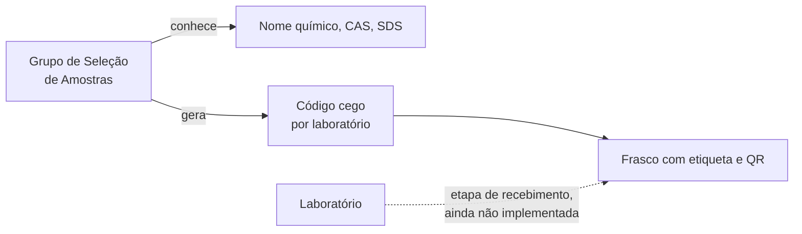

# Amostras cegas

Num ensaio interlaboratorial, o laboratório não pode saber qual substância
está testando. O backend separa quem conhece a identidade das substâncias de
quem só manipula frascos codificados.

## Quem sabe o quê

| Quem | Nome, CAS, SDS, códigos e frascos |
|---|---|
| `sample_selection_group` do processo | Sim |
| Laboratórios, Grupo Gestor | Não (`404`) |
| Admin, BraCVAM | Não (`403` no conteúdo; veem a tarefa e seu status) |
| Qualquer um com conflito de interesse vigente | Não |

Mesmo a leitura exige a concessão de **edição** da atividade
`sample_definition`, que só o Grupo de Seleção de Amostras tem. Isso impede
que um cargo com permissão só de ver acesse a identidade das substâncias.

## O código

- 8 caracteres do alfabeto `23456789ABCDEFGHJKMNPQRSTUVWXYZ`, sem `0`, `O`,
  `1`, `I` e `L`, para não confundir na leitura.
- Aleatório e único no processo.
- Um por substância e por laboratório participante. O mesmo frasco tem
  códigos diferentes em laboratórios diferentes.
- Não carrega informação sobre a substância nem sobre o laboratório.
- O laboratório líder não recebe código por ser líder.

## O QR do frasco

O QR contém só `{SAMPLE_QR_BASE_URL}/amostras/{process_id}/frascos/{code}`,
uma página do frontend que chama `GET /processes/{id}/samples/vials/{code}`.
Essa rota devolve só o necessário para manusear o frasco com segurança:
código, lote e instruções. Nunca o nome químico, o CAS ou a SDS.

!!! note "Estado atual"
    A rota do frasco exige o mesmo acesso das demais rotas de amostras, então
    hoje só o Grupo de Seleção de Amostras consegue lê-la. O acesso dos
    laboratórios aos próprios frascos virá com a etapa de recebimento de
    amostras.

## Auditoria sem vazamento

Os eventos `SAMPLE_*` da linha do tempo guardam só identificadores e
contagens. A linha do tempo é visível a outros participantes, então ela não
pode carregar a identidade das substâncias.

## O congelamento

Ao concluir `sample_definition`, a lista de laboratórios com código fica
congelada. Ela define quem ganha execução nas atividades por laboratório.
Veja [Isolamento por laboratório](isolamento-por-laboratorio.md#laboratorios-congelados).

Como fazer: [Definir amostras cegas](../guias/definir-amostras-cegas.md).
