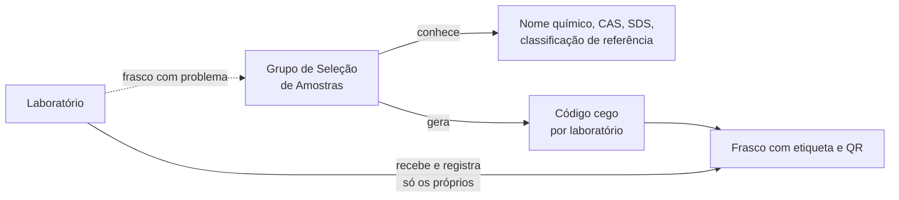

# Amostras cegas

Num ensaio interlaboratorial, o laboratório não pode saber qual substância
está testando. O backend separa quem conhece a identidade das substâncias de
quem só manipula frascos codificados.

## Quem sabe o quê

| Quem | Nome, CAS, SDS, classificação de referência, todos os códigos | Visão cega do frasco |
|---|---|---|
| `sample_selection_group` do processo | Sim | Todos os frascos |
| Laboratório participante | Não (`404`) | Só os do próprio laboratório; os demais respondem `404` |
| Grupo Gestor | Não (`404`) | Não (`404`) |
| Admin, BraCVAM | Não (`403` no conteúdo; veem a tarefa e seu status) | Não (`403`) |
| Qualquer um com conflito de interesse vigente | Não | Não |

Mesmo a leitura exige a concessão de **edição** da atividade
`sample_definition`, que só o Grupo de Seleção de Amostras tem. Isso impede
que um cargo com permissão só de ver acesse a identidade das substâncias.

## O código

- 8 caracteres do alfabeto `23456789ABCDEFGHJKMNPQRSTUVWXYZ`, sem `0`, `O`,
  `1`, `I` e `L`, para não confundir na leitura.
- Aleatório e único no processo.
- Um por substância e por laboratório participante. O mesmo frasco tem
  códigos diferentes em laboratórios diferentes.
- Não carrega informação sobre a substância nem sobre o laboratório.
- O laboratório líder não recebe código por ser líder.

## O QR do frasco

O QR contém só `{SAMPLE_QR_BASE_URL}/amostras/{process_id}/frascos/{code}`,
uma página do frontend que chama `GET /processes/{id}/samples/vials/{code}`.
Essa rota devolve só o necessário para manusear e conservar o frasco:
código, lote, instruções de manuseio, pictogramas GHS, regime e faixa de
temperatura, quantidade e unidade, tipo de recipiente e validade. Nunca o
nome químico, o CAS, a SDS ou a classificação de referência.

O laboratório usa a faixa para conferir a temperatura de chegada. A tela
pode avisar o analista antes do envio que a temperatura medida está fora
dela; o backend refaz a conta no registro.

## A classificação de referência

`reference_classification` é o gabarito do estudo: o desfecho conhecido da
substância no ensaio (ex.: *Severamente irritante / Categoria 1*). É
obrigatória no cadastro e só o Grupo de Seleção a lê. A estatística da
Etapa 4 vai compará-la com os resultados dos laboratórios; a leitura por
outros cargos entra com ela.

## O reenvio troca o código

Quando o Grupo de Seleção reenvia um frasco com problema, o sistema debita
um frasco da reserva da substância e gera um código novo para a mesma
substância e o mesmo laboratório. Com o código antigo, o analista poderia
associar o frasco reenviado ao que chegou avariado. O vínculo "código novo
substitui o anterior" fica gravado e só o Grupo de Seleção o vê. O registro
do frasco anterior continua guardado.

## Auditoria sem vazamento

Os eventos `SAMPLE_*` da linha do tempo guardam só identificadores e
contagens, nunca o código em texto nem a justificativa de uma decisão. A linha do tempo é visível a outros participantes, então ela não
pode carregar a identidade das substâncias.

## O congelamento

Ao concluir `sample_definition`, a lista de laboratórios com código fica
congelada. Ela define quem ganha execução nas atividades por laboratório.
Veja [Isolamento por laboratório](isolamento-por-laboratorio.md#laboratorios-congelados).

Como fazer: [Definir amostras cegas](../guias/definir-amostras-cegas.md) e
[Receber amostras](../guias/receber-amostras.md).
