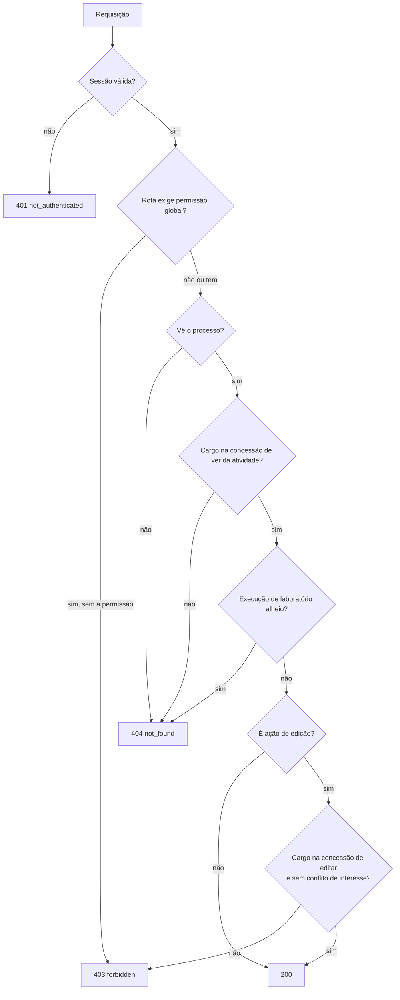
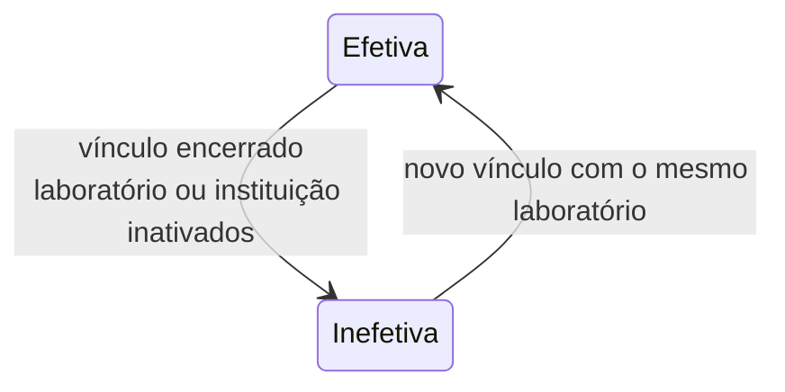

# Autorização

A API decide o acesso em camadas. Cada camada só restringe a anterior.

## As camadas

| Camada | Pergunta | Fonte |
|---|---|---|
| Permissão global | O usuário pode usar esta funcionalidade? | Perfis globais (`Administrador`, `BraCVAM`, perfis criados) |
| Visibilidade do processo | O usuário participa do processo? | Admin e BraCVAM veem todos; os demais, os processos em que têm atribuição ativa |
| Concessão da atividade | O cargo do usuário vê ou edita esta atividade? | `view` e `edit` do template, copiados para a atividade |
| Laboratório | A execução é do laboratório do usuário? | Designação de `participating_laboratory` |
| Conflito de interesse | O usuário declarou conflito neste processo? | Declarações vigentes |

Permissões e cargos são consultados no banco a cada requisição. O token não
carrega nada além da identidade, então tirar um perfil ou revogar uma
designação vale no pedido seguinte.

## Concessões valem para cargos, não para pessoas

Uma atividade nunca lista usuários. Ela lista cargos (`edit: ["bracvam"]`), e
o usuário tem cargos no processo:

- por designação ativa e efetiva;
- `admin` e `bracvam`, pelo perfil global, em qualquer processo.

Admin e BraCVAM veem toda atividade. Editar exige que o cargo esteja em
`edit`. Por isso o Administrador lê a triagem, mas não decide: a triagem só
concede edição a `bracvam`.

## Ver o processo não é ver tudo

Quem tem atribuição no processo vê o cabeçalho dele. Formulários, versões,
anexos, pré-avaliação, tarefas e eventos da linha do tempo seguem a concessão
de ver de cada atividade. O proponente, por exemplo, vê a própria submissão,
mas não vê os eventos da triagem.

## `404` em vez de `403`

Quando o usuário não pode ver algo, a resposta é `404`, igual à de um recurso
inexistente. Assim a API não revela que um processo, uma atividade ou um
laboratório existem. O `403` aparece quando o usuário vê, mas não pode agir.

## Designação efetiva

Uma designação ativa só dá acesso quando é efetiva:

- o usuário está ativo; e
- nos cargos de laboratório, o usuário tem vínculo ativo com o laboratório da
  designação, e o laboratório e a instituição estão ativos.

A perda de efetividade não revoga a designação nem mexe em tarefas ou dados:
só retira o acesso enquanto durar. Nos processos em andamento, cada mudança
vira `PARTICIPANT_EFFECTIVENESS_LOST` ou `_RESTORED` na linha do tempo. A
mesma regra decide a autorização, o campo `effective` da listagem de
participantes, os escopos de `GET /auth/me` e a validação de novas
designações.

## Conflito de interesse

Uma declaração de conflito vigente, em qualquer cargo do processo, bloqueia o
usuário de decidir naquele processo: parecer e decisão de triagem, ação em
tarefas (`can_act` falso), arquivamento e leitura das amostras cegas.

Valores de perfis, permissões e cargos:
[Perfis, permissões e cargos](../referencia/perfis-permissoes-cargos.md).
