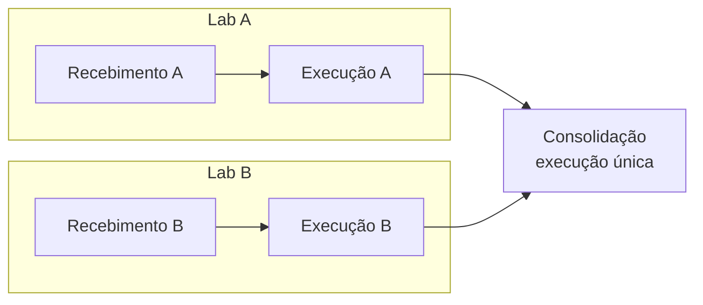

# Isolamento por laboratório

No ensaio interlaboratorial, cada laboratório executa o protocolo sem ver o
trabalho dos outros. O backend tem um motor para isso: uma atividade pode ser
executada uma vez por laboratório, e cada execução só é visível ao próprio
laboratório e ao gestor do processo.

!!! note "Estado atual"
    O motor está pronto, mas nenhum template padrão declara atividades por
    laboratório. As atividades da Etapa 3 (recebimento, execução, resultados)
    ainda não existem.

## Como uma atividade vira "por laboratório"

No template:

```yaml
execution_scope: "per_laboratory"   # padrão: "process"
custody: true                       # só para devolução ou descarte
```

A carga do template recusa: modo desconhecido; atividade por laboratório sem
dependência (direta ou transitiva) de `sample_definition`; atividade por
laboratório que `participating_laboratory` não edita; `custody` fora de
atividade por laboratório.

## Laboratórios congelados

Os laboratórios de um estudo são os que receberam código cego na conclusão de
`sample_definition`. Essa lista fica congelada: quem for designado depois não
ganha execução, e quem perder a designação mantém a sua.

## Uma cadeia por laboratório



- Cada laboratório congelado ganha uma execução. Com as dependências
  resolvidas, ela nasce `IN_PROGRESS` com tarefa; senão `BLOCKED`, sem tarefa.
- Entre duas atividades por laboratório, a execução do laboratório A avança
  quando a anterior do laboratório A conclui ou é dispensada, sem esperar o
  laboratório B. O prazo conta desse momento.
- A atividade conclui quando todo laboratório congelado tem execução
  `COMPLETED` ou `WAIVED`. Só então abre a atividade de execução única que
  depende dela.

## Quem vê e quem age

| Quem | Lê a execução de um laboratório | Age nela |
|---|---|---|
| `participating_laboratory` efetivo pelo laboratório da execução | Sim | Sim, com concessão de edição |
| `participating_laboratory` de outro laboratório | `404` | `404` |
| `lead_laboratory`, `sample_selection_group`, `statistician` e demais | `404` | Não |
| `group_manager` efetivo | Sim | `403` |
| Admin, BraCVAM | Sim | Só se o template der edição a `admin`/`bracvam` |

- O `404` de outro laboratório é idêntico ao de uma execução inexistente.
- `lead_laboratory` não dá acesso a execução nenhuma, nem à do próprio
  laboratório. Quem é líder por um laboratório e participante por outro vê só
  as execuções do segundo.
- Um usuário tem no máximo uma designação ativa de `participating_laboratory`
  por processo.
- `GET /tasks`, `GET /tasks/{id}` e a linha do tempo aplicam a mesma regra. O
  evento de dispensa só aparece para o gestor.

## Intervenções do gestor

| Ação | Rota | Efeito |
|---|---|---|
| Dispensar | `POST /processes/{id}/phases/{phase_key}/laboratory-waivers` com `laboratory_id`, `reason` | Marca `WAIVED` as execuções abertas ou bloqueadas do laboratório na fase, fora da custódia, e cancela as tarefas. A devolução/descarte continua obrigatória. Não pode ser desfeita |
| Reabrir | `POST /processes/{id}/activities/{activity_key}/laboratories/{laboratory_id}/reopen` com `reason` | A execução concluída vira `SUPERSEDED` (dados intactos) e abre a seguinte com formulário vazio. Dependentes de execução única voltam a `BLOCKED`; nas atividades por laboratório seguintes, só a cadeia desse laboratório volta a bloquear |

"Gestor do processo" é o `group_manager` efetivo, Admin ou BraCVAM.

| Erro | Quando |
|---|---|
| `409 sample_definition_not_frozen` | Dispensa antes de concluir as amostras |
| `422 laboratory_not_frozen` | Laboratório fora do conjunto congelado |
| `409 already_waived` | Segunda dispensa do mesmo laboratório na fase |
| `409` | Reabrir execução aberta, bloqueada ou de laboratório dispensado |

## O que ainda falta

- Formulários em atividade por laboratório respondem `409 invalid_transition`.
- Não há rota HTTP para concluir a execução de um laboratório: as próximas
  atividades vão chamar a função `complete_laboratory_run` do motor.
