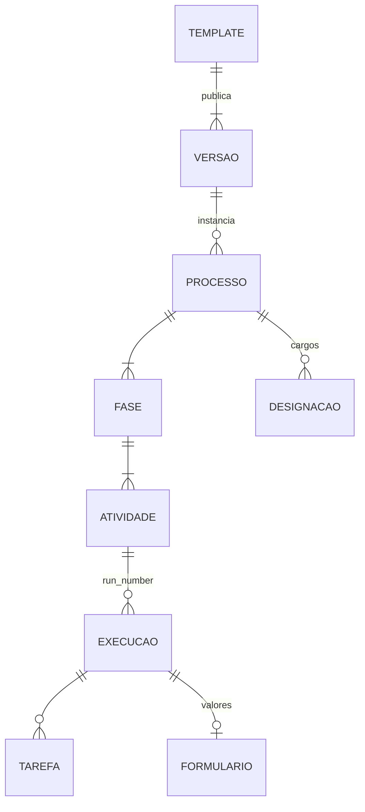
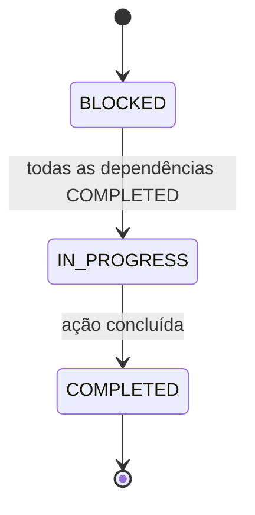
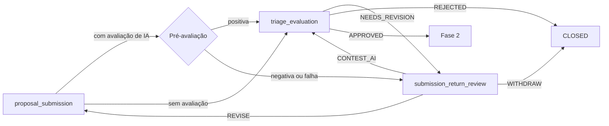

# Modelo de processo

Um processo de validação é uma instância de um template. O template define
fases e atividades; o processo guarda o andamento delas.

## Entidades

| Entidade | Papel |
|---|---|
| Template e versão | Definição declarativa (YAML). O processo fica na versão em que nasceu |
| Processo | Título, código, ciclo de vida (`OPEN`, `CLOSED`, `CANCELLED`, `ARCHIVED`) |
| Fase | Agrupa atividades em ordem |
| Atividade | Unidade de trabalho com cargo responsável, concessões de ver/editar, dependências e prazo |
| Execução | Uma tentativa da atividade. Reenvio, revisão ou reabertura criam a seguinte |
| Tarefa | O que aparece em `GET /tasks` para o cargo agir |
| Designação | Liga um usuário a um cargo no processo |

## O processo não guarda a etapa

O `status` do processo diz só se ele está vivo. Onde ele está no fluxo vem
das atividades: várias podem estar abertas ao mesmo tempo (as oito
designações da Fase 2, por exemplo). Por isso o frontend monta o quadro a
partir das tarefas, e não de um campo "etapa atual".

## Como uma atividade abre

Ao concluir uma atividade, o motor verifica as que dependem dela. Cada uma
cujas dependências estão todas concluídas abre uma execução com tarefa, e o
evento `ACTIVITY_UNBLOCKED` vai para a linha do tempo. A primeira atividade
da primeira fase abre na criação do processo.

O prazo da tarefa é `sla_hours` somado à abertura da execução.

## Fase 1: submissão e triagem

`submission_return_review` não tem dependências: nasce bloqueada e o motor a
abre por evento, quando a IA ou a triagem devolvem a submissão.

## Fase 2: composição da governança

A triagem aprovada abre `assign_sponsor` e `assign_group_manager` para o
proponente. Com o Grupo Gestor designado, abrem as demais atribuições. Cada
atividade de atribuição fecha sozinha quando o cargo recebe a primeira
designação e não há convite pendente para ele. `sample_definition` abre
quando o Grupo de Seleção de Amostras e os laboratórios participantes estão
designados. Detalhes em [Templates de processo](../referencia/templates.md).

## Etapa 3: execução por laboratório

O motor já suporta atividades executadas por laboratório, mas nenhum template
as declara ainda. Veja
[Isolamento por laboratório](isolamento-por-laboratorio.md).

## Encerramento

| Ação | Quem | Efeito |
|---|---|---|
| Rejeitar na triagem | BraCVAM | `CLOSED` |
| Desistir na revisão do retorno | Proponente | `CLOSED` |
| Excluir | Proponente ou Admin/BraCVAM, com o processo `OPEN` | `CANCELLED`; fases, atividades, execuções, tarefas e pré-avaliações abertas são canceladas; documentos ficam |
| Arquivar | Quem tem `triage.review`, sem conflito de interesse | `ARCHIVED`, a partir de `CLOSED` ou `CANCELLED` |

Processo encerrado não aceita mutações (`409`).
