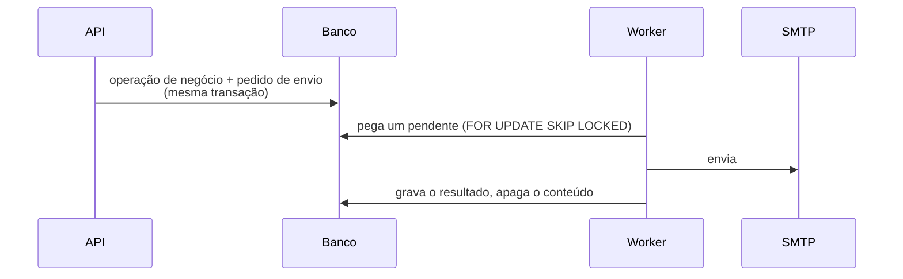
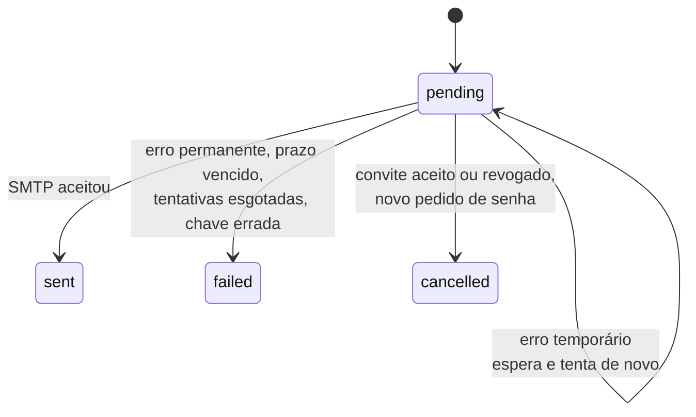

# Notificações

Usos atuais: convite por e-mail, recuperação de senha, aviso de problema no
recebimento de amostras e aviso da decisão sobre esse problema.

## Gravar junto, enviar depois

A operação de negócio e o pedido de envio são gravados na mesma transação.
Se a operação for desfeita, nada é enviado. Se o servidor de e-mail estiver
fora do ar, a operação não falha: o envio fica pendente e o worker tenta
depois.

O worker pega um envio por vez com `FOR UPDATE SKIP LOCKED`, então vários
workers podem rodar sem enviar a mesma mensagem duas vezes.

## Tentativas

| Erro | Tratamento |
|---|---|
| Temporário (4xx do SMTP, conexão, timeout) | Tenta de novo após 30 s, 60 s, 120 s… até 900 s, no máximo 5 vezes |
| Permanente (5xx, destinatário recusado) | Falha na hora |
| Prazo do convite ou do link vencido | Falha como `expired`, sem enviar |

## Conteúdo protegido

O conteúdo da mensagem fica cifrado no banco com `NOTIFICATION_ENCRYPTION_KEY`
(Fernet) enquanto está pendente, e é apagado quando o envio termina. Logs e
auditoria registram só identificadores, o tipo e o canal.

## Problema no recebimento

Quando um laboratório registra um frasco fora de ordem, cada pessoa com
designação ativa no Grupo de Seleção de Amostras do processo recebe um e-mail
(`sample_receipt_nonconformity_email`) com o código do processo, o
laboratório, o código cego e o motivo. O e-mail nunca traz nome químico, CAS
nem SDS.

Quando o Grupo decide, cada pessoa com designação efetiva pelo laboratório
do frasco recebe um e-mail (`sample_receipt_decision_email`) com o código do
processo, o laboratório, o código cego, a situação resultante e a orientação
do Grupo, quando houver. O e-mail nunca traz a justificativa nem o código do
frasco novo.

Sem `NOTIFICATION_EMAIL_BACKEND`, o registro do laboratório e a decisão do
Grupo seguem: o Grupo recebe só a tarefa e o laboratório lê a orientação na
lista de frascos. Ao contrário do convite, esses avisos não são recusados,
porque ninguém pode ficar travado por uma configuração da implantação.

## Rastro

Envios ligados a um processo (convites e avisos de recebimento) gravam `NOTIFICATION_SENT`,
`NOTIFICATION_FAILED` ou `NOTIFICATION_CANCELLED` na linha do tempo. O convite
mostra a situação em `delivery`.

## Limite conhecido

Se o worker cair depois que o servidor SMTP aceitou a mensagem e antes de
gravar o resultado, a mensagem pode sair de novo.

## Estender

Um novo tipo de aviso precisa de um `kind`, um renderizador em
`src/pivma/notifications/renderers.py` (assunto, texto e HTML) e uma chamada a
`enqueue_notification` dentro da transação da operação.
