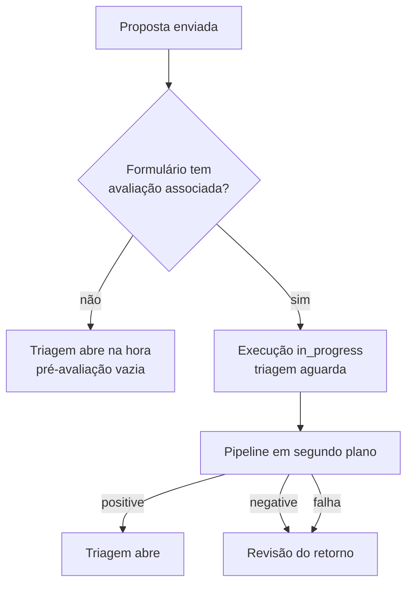

# Pré-avaliação por IA

A IA lê a submissão antes da triagem e aponta o que não atende aos critérios
configurados pelo BraCVAM. Ela filtra; não decide.

## Quando roda

Ao enviar a proposta, o backend procura avaliações associadas ao formulário.

Enquanto a pré-avaliação roda, a submissão fica travada e a triagem mostra o
motivo do bloqueio. Ela aparece em `GET /tasks?include=summary` como
`ai_pre_evaluation_in_progress`.

## O pipeline

Para cada avaliação associada, na versão publicada (ou na fixada em
`pinned_version_id`):

1. Prepara o conteúdo dos campos alvo.
2. Avalia cada critério no modelo adequado ao tipo de verificação:
   `presence` e `conformity` no modelo rápido; `quality`, `comparison` e
   `cross_field_consistency` no de raciocínio.
3. Cada critério termina como `compliant`, `non_compliant`, `partial` ou
   `indeterminate`. Falta de informação vira o que o critério definir em
   `on_missing_info`.
4. Consolida e registra o resultado e os itens.

## A regra de consolidação

O resultado é **positivo só se todos os critérios forem `compliant`**.
Qualquer `non_compliant`, `partial` ou `indeterminate` torna o resultado
negativo, independentemente da severidade.

A severidade continua registrada em cada item, para orientar quem lê, mas não
entra na decisão.

## Por que a IA não decide

- Resultado positivo leva à triagem humana, não à aprovação.
- Resultado negativo leva ao proponente, que pode revisar, **contestar a IA**
  (a submissão vai à triagem sem mudanças) ou desistir.
- O triador registra se concorda com cada item (`agree`, `disagree`,
  `inconclusive`). Isso não muda o resultado; alimenta a métrica de
  concordância que mostra se os critérios estão bem calibrados.

Em todos os caminhos, quem aprova ou rejeita é uma pessoa com o perfil
BraCVAM.

## Falhas

| Situação | Efeito |
|---|---|
| Provedor de IA falha durante a execução | Execução `failed`; abre a revisão do retorno |
| API reinicia com execução em andamento | Na subida, a execução presa é marcada como falha |
| Administrador reprocessa (`POST /admin/pre-evaluations/{run_id}/retry`) | Nova execução; a antiga fica como estava; a revisão do retorno aberta é cancelada |

## Versões imutáveis

Uma versão publicada não muda. Toda pré-avaliação registra qual versão usou,
então é possível saber por que um resultado saiu como saiu, mesmo depois de
os critérios mudarem.

## Provedor

`AI_PROVIDER=openai` usa a OpenAI via LangChain. `AI_PROVIDER=fake` é
determinístico e sem rede, para testes e desenvolvimento.

Como configurar: [Configurar a pré-avaliação por IA](../guias/configurar-avaliacao-ia.md).
