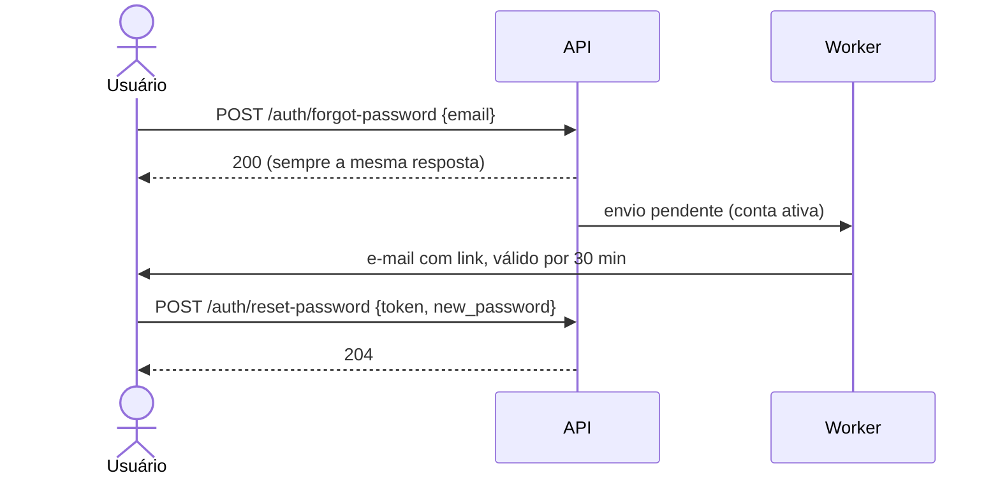

# Sessão e segurança

## A sessão

O login emite um JWT assinado com `JWT_SECRET_KEY`, válido por até 8 horas.
Ele carrega só a identidade do usuário; perfis e cargos são consultados no
banco a cada requisição.

O token chega ao servidor por um destes meios, nesta ordem:

| Meio | Uso |
|---|---|
| Cookie `access_token` (`HttpOnly`, `Secure`, `SameSite=Strict`) | Frontend no navegador |
| `Authorization: Bearer <token>` | Scripts, integrações, `/docs` |
| Parâmetro de URL `?token=` | Aceito por compatibilidade |

!!! warning "Token na URL"
    O parâmetro `?token=` vem das páginas de demonstração, já removidas. Um
    token na URL pode ficar em logs e no histórico do navegador. Não use; a
    remoção está pendente.

Conta desativada perde a sessão no pedido seguinte, mesmo com token válido.

## Proteção contra CSRF

O navegador anexa o cookie sozinho, então uma página maliciosa poderia
disparar uma mutação em nome do usuário. Duas barreiras:

1. `SameSite=Strict`: o navegador não envia o cookie em requisições
   iniciadas por outro site.
2. Checagem de origem: nas rotas protegidas, uma mutação com cookie exige
   `Origin` presente em `AUTH_ALLOWED_ORIGINS`, senão `403 invalid_origin`.

Requisições só com `Bearer` dispensam a checagem, porque o navegador nunca
anexa esse cabeçalho sozinho.

Todas as mutações com sessão checam a origem. Só as rotas públicas
(`POST /users`, login e recuperação de senha) não checam, porque não usam
sessão.

## Senhas

- 8 a 128 caracteres, sem espaços. Hash Argon2id.
- Erros de validação de senha nunca expõem a regra nem o valor
  (`code: invalid`).
- Trocar a senha pelo `PATCH /auth/me` exige a senha atual e mantém a sessão.

## Recuperação de senha

- A resposta é igual exista ou não a conta, para não revelar quem está
  cadastrado.
- O token é de uso único; um novo pedido invalida o anterior e cancela o
  e-mail pendente.
- O banco guarda só o hash SHA-256 do token, e ele nunca vai para o log.
- Qualquer token inválido responde o mesmo `400 invalid_reset_token`. Senha
  fora da regra responde `422` e o token continua válido.

Limites conhecidos: sessões abertas continuam válidas depois da redefinição;
não há limite de tentativas nem limpeza de tokens antigos.

## O que nunca sai da API

- Valores enviados, nos erros.
- Detalhes internos de exceção (vão só para o log).
- E-mail nas referências resumidas de pessoa.
- Destinatário e conteúdo de notificações, na auditoria.
- Identidade de substâncias, fora do Grupo de Seleção de Amostras.
