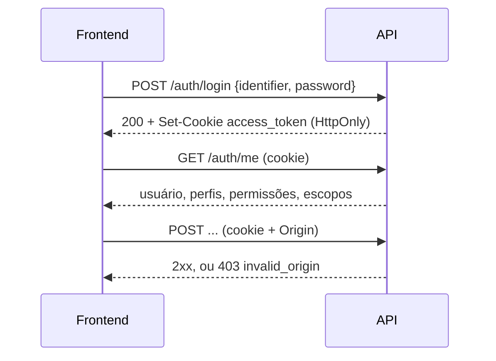

# Autenticar no frontend

## No navegador: cookie



1. Envie o login com `credentials: 'include'`:

    ```js
    await fetch(`${API}/auth/login`, {
      method: 'POST',
      credentials: 'include',
      headers: { 'Content-Type': 'application/json' },
      body: JSON.stringify({ identifier, password }),
    });
    ```

    `identifier` aceita o `username` ou o e-mail. Credenciais erradas
    respondem `401 invalid_credentials`.

2. Use `credentials: 'include'` em todas as chamadas. O navegador envia o
   cookie `access_token` e o cabeçalho `Origin` sozinho.
3. Ignore o `access_token` do corpo do login. Ele existe para clientes fora
   do navegador; guardá-lo em `localStorage` anula a proteção do cookie
   `HttpOnly`.
4. Cadastre a origem do frontend em `AUTH_ALLOWED_ORIGINS`. Sem isso, as
   rotas protegidas contra CSRF respondem `403 invalid_origin`.
5. Leia `GET /auth/me` para montar a interface:

    | Campo | Uso |
    |---|---|
    | `user` | Identidade (`id`, `username`, `email`, `full_name`) |
    | `access.profiles` | Perfis globais (`Administrador`, `BraCVAM`) |
    | `access.global_permissions` | Códigos de permissão efetivos |
    | `access.scopes` | Um item por processo: `process_id`, `roles`, `institution_id`, `laboratory_id` |

6. Para sair, `POST /auth/logout` (`204`).

A sessão dura até 8 horas. Depois disso, qualquer chamada responde
`401 not_authenticated`: leve o usuário de volta ao login.

## Fora do navegador: Bearer

Scripts e integrações usam o token do corpo do login:

```bash
TOKEN=$(curl -s -X POST $API/auth/login -H 'Content-Type: application/json' \
  -d '{"identifier":"maria","password":"senha-segura-123"}' | jq -r .access_token)
```

```bash
curl -s $API/auth/me -H "Authorization: Bearer $TOKEN"
```

Chamadas com `Bearer` e sem cookie dispensam a checagem de origem. Se a
requisição trouxer os dois, vale o cookie.

## Conta do próprio usuário

| Ação | Rota | Observação |
|---|---|---|
| Criar conta | `POST /users` | Pública. `username`, `email`, `full_name`, `password` |
| Mudar nome ou senha | `PATCH /auth/me` | `full_name`, `current_password`, `new_password`. Senha nova exige a atual |
| Pedir redefinição | `POST /auth/forgot-password` | Pública. Responde sempre `200`, exista ou não a conta |
| Redefinir | `POST /auth/reset-password` | Pública. `token` do e-mail e `new_password`; `204` |

A página de redefinição do frontend recebe o token pela URL configurada em
`PASSWORD_RESET_URL_TEMPLATE`. Regras e limites em
[Sessão e segurança](../explicacao/sessao-e-seguranca.md).
