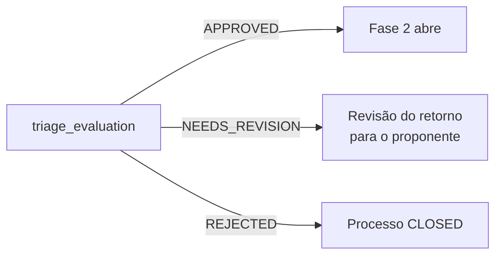

# Conduzir a triagem

A triagem é a atividade `triage_evaluation`. Só o cargo `bracvam` edita, e a
rota exige a permissão `triage.review`. Na prática: só quem tem o perfil
global BraCVAM decide. O Administrador lê a triagem, mas não decide.



## 1. Encontrar o que triar

```bash
curl -s "$API/tasks?activity_key=triage_evaluation&status=READY" \
  -H "Authorization: Bearer $TOKEN"
```

## 2. Ler a submissão e a pré-avaliação

```bash
curl -s $API/processes/$PID/activities/proposal_submission/form \
  -H "Authorization: Bearer $TOKEN"
```

```bash
curl -s $API/processes/$PID/pre-evaluation -H "Authorization: Bearer $TOKEN"
```

A pré-avaliação mostra o resultado consolidado e o resultado de cada critério.
Sem avaliação associada ao formulário, ela vem vazia.

## 3. Registrar parecer por campo (opcional)

```bash
curl -s -X POST $API/processes/$PID/triage/reviews -H "Authorization: Bearer $TOKEN" \
  -H 'Content-Type: application/json' \
  -d '{"reviews":[{"field_key":"method_title","status":"CONFORME","comments":"Claro."}]}'
```

`status` é texto livre; a API não valida os valores. Os pareceres aparecem em
`reviews` na leitura do formulário.

## 4. Dar retorno sobre a IA (opcional)

Para cada item da pré-avaliação, o triador pode concordar ou discordar:

```bash
curl -s -X POST $API/processes/$PID/pre-evaluation/$RUN_ID/feedback \
  -H "Authorization: Bearer $TOKEN" -H 'Content-Type: application/json' \
  -d '{"items":[{"item_id":"…","verdict":"disagree","reason":"Critério mal aplicado."}]}'
```

`verdict`: `agree`, `disagree` ou `inconclusive`. O retorno não muda o
resultado da IA; ele alimenta `GET /ai-evaluations/agreement-metrics`.

## 5. Decidir

```bash
curl -s -X POST $API/processes/$PID/triage/decision -H "Authorization: Bearer $TOKEN" \
  -H 'Content-Type: application/json' \
  -d '{"outcome":"NEEDS_REVISION","justification":"Faltam os controles positivos."}'
```

| `outcome` | Efeito | Campo de resposta |
|---|---|---|
| `APPROVED` | Conclui a Fase 1 e abre a Fase 2 | `process_status: OPEN` |
| `NEEDS_REVISION` | Abre `submission_return_review` para o proponente | `return_review_run` (número da execução) |
| `REJECTED` | Encerra o processo | `process_status: CLOSED` |

`justification` é obrigatória (mínimo de 3 caracteres) e o proponente a lê na
revisão do retorno.

| Erro | Quando |
|---|---|
| `403 forbidden` | Sem `triage.review`, sem o cargo `bracvam` na atividade, ou com conflito de interesse vigente no processo |
| `409` | A triagem não está em andamento (já decidida ou ainda esperando a IA) |

## Arquivar

Processos `CLOSED` ou `CANCELLED` podem ser arquivados por quem tem
`triage.review`:

```bash
curl -s -X PATCH $API/processes/$PID/archive -H "Authorization: Bearer $TOKEN"
```
