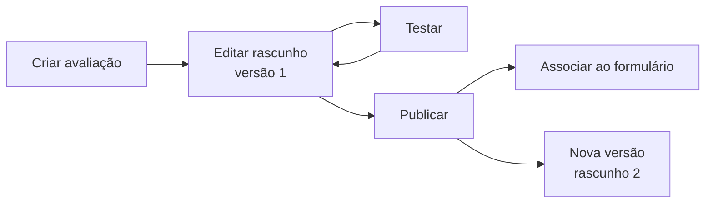

# Configurar a pré-avaliação por IA

Quem tem `ai_evaluations.manage` (BraCVAM e Administrador) monta avaliações
com critérios em linguagem natural e as associa a campos de formulário. Uma
submissão só passa pela IA se o formulário tiver ao menos uma associação
ativa.



## 1. Criar a avaliação

```bash
curl -s -X POST $API/ai-evaluations -H "Authorization: Bearer $TOKEN" \
  -H 'Content-Type: application/json' \
  -d '{"name":"Justificativa científica","mode":"simple",
       "objective":"Avaliar a justificativa científica submetida."}'
```

Cria a avaliação e a versão 1 em rascunho. O nome é único (`409` se
repetido).

## 2. Escrever os critérios

```bash
curl -s -X PATCH $API/ai-evaluations/$DEF_ID/versions/1 -H "Authorization: Bearer $TOKEN" \
  -H 'Content-Type: application/json' \
  -d '{"criteria":[{"order_index":0,"statement":"Deve apresentar metodologia detalhada",
                    "check_type":"quality","severity":"high"}]}'
```

| Campo do critério | Valores |
|---|---|
| `check_type` | `presence`, `conformity`, `quality`, `comparison`, `cross_field_consistency` |
| `polarity` | `positive` (padrão), `negative`, `consistency` |
| `severity` | `info`, `low`, `medium` (padrão), `high`, `critical` |
| `on_missing_info` | `indeterminate` (padrão) ou `non_compliant` |
| `required_evidence`, `recommendation_hint` | Texto livre |

`objective` e `references` (ids de referências normativas) também podem ir no
`PATCH`. Para pedir sugestões de critérios à IA:
`POST /ai-evaluations/suggest-criteria`.

## 3. Testar o rascunho

```bash
curl -s -X POST $API/ai-evaluations/$DEF_ID/versions/1/test -H "Authorization: Bearer $TOKEN" \
  -H 'Content-Type: application/json' \
  -d '{"sample_content":"Texto de exemplo para avaliar."}'
```

Só versões em rascunho podem ser testadas.

## 4. Publicar

```bash
curl -s -X POST $API/ai-evaluations/$DEF_ID/versions/1/publish -H "Authorization: Bearer $TOKEN"
```

Exige ao menos um critério. Versão publicada não muda: para alterar, crie a
próxima com `POST /ai-evaluations/{id}/versions` (só pode haver um rascunho
por vez).

## 5. Associar ao formulário

Veja os campos avaliáveis e substitua as associações do template de
formulário:

```bash
curl -s $API/form-templates/submission_validated_dossier_v1/evaluable-fields \
  -H "Authorization: Bearer $TOKEN"
```

```bash
curl -s -X PUT $API/form-templates/submission_validated_dossier_v1/evaluation-assignments \
  -H "Authorization: Bearer $TOKEN" -H 'Content-Type: application/json' \
  -d '{"assignments":[{"definition_id":"'$DEF_ID'","target_type":"field",
                       "field_keys":["terminology_notes"]}]}'
```

| `target_type` | `field_keys` |
|---|---|
| `field`, `field_set`, `document` | Chaves válidas do formulário |
| `form`, `process` | Vazio |

Sem `pinned_version_id`, vale a versão publicada mais recente. A avaliação
precisa ter versão publicada.

## Referências normativas

`POST /ai-evaluations/references` registra uma norma (`identifier`, `label`,
`version_label`, `reference_date`). `GET .../references/{id}/impact` mostra
quais avaliações a citam. Identificador e versão repetidos: `409`.

## Medir a concordância

`GET /ai-evaluations/agreement-metrics` resume o retorno dos triadores
(`agree`, `disagree`, `inconclusive`) sobre os resultados da IA.

## Excluir

`DELETE /ai-evaluations/{id}` exclui uma avaliação sem associação. Com
associação, responde `409`; use `?force=true` para excluir mesmo assim.

Como o resultado é calculado: [Pré-avaliação por IA](../explicacao/pre-avaliacao-ia.md).
