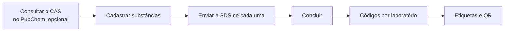

# Definir amostras cegas

A atividade `sample_definition` abre quando as designações do Grupo de
Seleção de Amostras e dos laboratórios participantes estão concluídas. Só o
cargo `sample_selection_group` age nela, e todas as rotas exigem a concessão
de edição, inclusive as de leitura.



Rota base: `/processes/{id}/samples`.

## 1. Consultar o CAS no PubChem (opcional)

```bash
curl -s "$API/processes/$PID/samples/lookup?cas=50-00-0" -H "Authorization: Bearer $TOKEN"
```

A resposta sugere `chemical_name`, `iupac_name` e `ghs_hazard_pictograms`,
com `pubchem_cid` e `source_url` para conferir a página do composto. A
consulta não grava nada: você revisa as sugestões e as envia no cadastro,
corrigidas ou não. Os pictogramas vêm do primeiro bloco de classificação GHS
que o PubChem exibe.

| Erro | Quando |
|---|---|
| `422 invalid_cas` | CAS inválido; o PubChem nem é chamado |
| `404 compound_not_found` | O PubChem não conhece o CAS |
| `503 lookup_unavailable` | PubChem fora do ar, com erro ou lento (`PUBCHEM_TIMEOUT_SECONDS`); cadastre à mão |

## 2. Cadastrar substâncias

```bash
curl -s -X POST $API/processes/$PID/samples -H "Authorization: Bearer $TOKEN" \
  -H 'Content-Type: application/json' \
  -d '{"chemical_name":"Formaldeído","cas_number":"50-00-0","lot":"L-2026-04",
       "purity":"≥ 37%","solubility":"Miscível em água",
       "safe_handling_instructions":"Tóxico por inalação. Usar luvas e capela.",
       "reference_classification":"Severamente irritante / Categoria 1",
       "storage_temperature_regime":"refrigerated",
       "vial_nominal_quantity":50,"vial_unit":"mL",
       "packaging_type":"Frasco de vidro âmbar com lacre inviolável",
       "expiration_date":"2027-03-31","reserve_vials_count":2,
       "ghs_hazard_pictograms":["GHS05","GHS06"]}'
```

Obrigatórios: `chemical_name`, `cas_number`, `lot`,
`safe_handling_instructions` e `reference_classification` (o gabarito; só o
Grupo de Seleção o lê). Cada cadastro já gera um código cego para cada
laboratório participante.

| Campo | Regra |
|---|---|
| `storage_temperature_regime` | `ambient`, `refrigerated`, `frozen`, `deep_frozen` ou `custom` |
| `storage_temperature_min`, `storage_temperature_max` | °C. Sem faixa, `ambient` grava 15 a 25 e `refrigerated`, 2 a 8; os demais regimes exigem os dois. Faixa sem regime é recusada |
| `vial_nominal_quantity`, `vial_unit` | Quantidade maior que zero por frasco e unidade (ex.: `mL`, `g`) |
| `packaging_type`, `expiration_date` | Tipo de recipiente e validade da alíquota |
| `reserve_vials_count` | Frascos de reserva, zero ou mais; cada reenvio do recebimento debita um |
| `ghs_hazard_pictograms` | `GHS01` a `GHS09`, sem repetição |

| Erro | Quando |
|---|---|
| `422 invalid_cas` | Formato ou dígito verificador do CAS inválido |
| `422 invalid_temperature_range` | Faixa sem regime, regime sem a faixa que exige ou mínima acima da máxima |
| `422 validation_error` | Classificação de referência ausente, pictograma inválido, quantidade ou reserva fora do permitido |
| `409 duplicate_cas` | CAS repetido entre as substâncias ativas do processo (em outro processo pode) |

`PATCH` e `DELETE /processes/{id}/samples/{substance_id}` editam e removem.
No `PATCH`, a regra de faixa vale sobre o resultado: mudar só a mínima para
acima da máxima gravada é recusado. Substâncias cadastradas antes da
classificação de referência aceitam alterações sem ela.

## 3. Enviar a SDS

```bash
curl -s -X PUT $API/processes/$PID/samples/$SUBSTANCE_ID/sds \
  -H "Authorization: Bearer $TOKEN" -F file=@sds.pdf
```

Só PDF, até `ATTACHMENT_MAX_SIZE_MB`. Enviar de novo substitui a anterior.

## 4. Concluir

```bash
curl -s -X POST $API/processes/$PID/samples/complete -H "Authorization: Bearer $TOKEN"
```

| Erro | Quando |
|---|---|
| `422 no_substances` | Nenhuma substância |
| `422 missing_sds` | Substância sem SDS (lista em `substance_ids`) |
| `422 no_laboratories` | Nenhum laboratório participante |

A conclusão gera os códigos que faltam, descarta os de laboratórios que
saíram, congela a lista de laboratórios e conclui a atividade. Depois disso,
qualquer alteração responde `409 invalid_transition`, e o recebimento abre
para cada laboratório ([Receber amostras](receber-amostras.md)).

## 5. Imprimir etiquetas

```bash
curl -s $API/processes/$PID/samples/labels -H "Authorization: Bearer $TOKEN"
```

Uma linha por frasco: estudo, laboratório, código, lote, `qr_url`,
pictogramas GHS, regime e faixa térmica, quantidade, recipiente e validade. A imagem
do QR vem de `GET /processes/{id}/samples/vials/{code}/qr.svg`
(`image/svg+xml`), para usar direto em ``. O frontend monta o layout e
imprime.

O QR aponta para `{SAMPLE_QR_BASE_URL}/amostras/{process_id}/frascos/{code}`,
uma página do frontend que chama `GET /processes/{id}/samples/vials/{code}`.
Essa rota devolve só os dados cegos do frasco. O Grupo de Seleção lê todos
os frascos; o laboratório participante, só os próprios.

Por que cada pessoa vê o que vê: [Amostras cegas](../explicacao/amostras-cegas.md).
