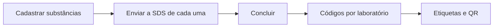

# Definir amostras cegas

A atividade `sample_definition` abre quando as designações do Grupo de
Seleção de Amostras e dos laboratórios participantes estão concluídas. Só o
cargo `sample_selection_group` age nela, e todas as rotas exigem a concessão
de edição, inclusive as de leitura.



Rota base: `/processes/{id}/samples`.

## 1. Cadastrar substâncias

```bash
curl -s -X POST $API/processes/$PID/samples -H "Authorization: Bearer $TOKEN" \
  -H 'Content-Type: application/json' \
  -d '{"chemical_name":"Formaldeído","cas_number":"50-00-0","lot":"L-2026-04",
       "purity":"≥ 37%","solubility":"Miscível em água",
       "safe_handling_instructions":"Tóxico por inalação. Usar luvas e capela."}'
```

Obrigatórios: `chemical_name`, `cas_number`, `lot`,
`safe_handling_instructions`. Cada cadastro já gera um código cego para cada
laboratório participante.

| Erro | Quando |
|---|---|
| `422 invalid_cas` | Formato ou dígito verificador do CAS inválido |
| `409 duplicate_cas` | CAS repetido entre as substâncias ativas do processo (em outro processo pode) |

`PATCH` e `DELETE /processes/{id}/samples/{substance_id}` editam e removem.

## 2. Enviar a SDS

```bash
curl -s -X PUT $API/processes/$PID/samples/$SUBSTANCE_ID/sds \
  -H "Authorization: Bearer $TOKEN" -F file=@sds.pdf
```

Só PDF, até `ATTACHMENT_MAX_SIZE_MB`. Enviar de novo substitui a anterior.

## 3. Concluir

```bash
curl -s -X POST $API/processes/$PID/samples/complete -H "Authorization: Bearer $TOKEN"
```

| Erro | Quando |
|---|---|
| `422 no_substances` | Nenhuma substância |
| `422 missing_sds` | Substância sem SDS (lista em `substance_ids`) |
| `422 no_laboratories` | Nenhum laboratório participante |

A conclusão gera os códigos que faltam, descarta os de laboratórios que
saíram, congela a lista de laboratórios e conclui a atividade. Depois disso,
qualquer alteração responde `409 invalid_transition`.

## 4. Imprimir etiquetas

```bash
curl -s $API/processes/$PID/samples/labels -H "Authorization: Bearer $TOKEN"
```

Uma linha por frasco: estudo, laboratório, código, lote e `qr_url`. A imagem
do QR vem de `GET /processes/{id}/samples/vials/{code}/qr.svg`
(`image/svg+xml`), para usar direto em ``. O frontend monta o layout e
imprime.

O QR aponta para `{SAMPLE_QR_BASE_URL}/amostras/{process_id}/frascos/{code}`,
uma página do frontend que chama `GET /processes/{id}/samples/vials/{code}`.
Essa rota devolve só código, lote e instruções de manuseio, e hoje exige o
mesmo acesso das demais rotas de amostras.

Por que cada pessoa vê o que vê: [Amostras cegas](../explicacao/amostras-cegas.md).
