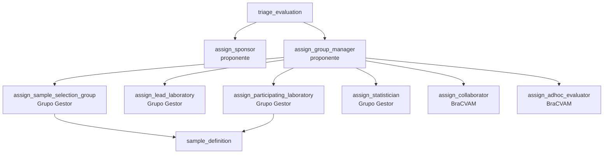

# Designar participantes

Com a triagem aprovada, a Fase 2 abre as atividades de atribuição de cargo.
Cada uma fecha quando o cargo recebe a primeira designação e não sobra convite
pendente para ele.



## Quem pode designar

| Quem | Cargos |
|---|---|
| Admin, BraCVAM (`process.participants.manage`) | Todos |
| `group_manager` efetivo no processo | Todos |
| `proponent` efetivo | `sponsor` e `group_manager` |

## Designar uma pessoa já cadastrada

```bash
curl -s -X POST $API/processes/$PID/participants -H "Authorization: Bearer $TOKEN" \
  -H 'Content-Type: application/json' \
  -d '{"user_id":"…","role_key":"group_manager"}'
```

Cargos de laboratório (`lead_laboratory`, `participating_laboratory`) exigem
`laboratory_id`, e o usuário precisa de vínculo ativo com esse laboratório.
Veja [Administrar usuários e acessos](administrar-usuarios-e-acessos.md#vincular-a-um-laboratorio).

| Erro | Quando |
|---|---|
| `403 forbidden` | Quem chama não pode designar esse cargo |
| `409 duplicate` | Mesmo usuário e cargo já ativos no processo, ou segunda designação de `participating_laboratory` do usuário no processo |
| `409 inactive_entity` | Usuário ou laboratório inativo |
| `409` | Usuário sem vínculo com o laboratório; processo encerrado |

## Convidar por e-mail

Para quem ainda não tem conta, ou para deixar a pessoa aceitar:

```bash
curl -s -X POST $API/processes/$PID/participants/invites -H "Authorization: Bearer $TOKEN" \
  -H 'Content-Type: application/json' \
  -d '{"email":"gestora@example.com","role_key":"group_manager","channel":"email"}'
```

| `channel` | Efeito |
|---|---|
| `link` (padrão) | A resposta traz o `token`; você compartilha o link |
| `email` | A API envia o link para o e-mail. Exige e-mail e `INVITE_URL_TEMPLATE` configurados, senão `409 channel_unavailable` |

O convite vale `INVITE_EXPIRATION_HOURS` (1 hora por padrão).
`GET .../invites` lista os convites com `delivery` (situação do envio).
Reenviar (`.../invites/{id}/resend`) renova o token e o prazo; revogar
(`.../invites/{id}/revoke`) cancela o envio pendente.

Quem recebe:

1. Abre a página do convite, que chama `GET /invites/{token}` (pública) para
   mostrar processo e cargo.
2. Entra ou cria a conta com o mesmo e-mail do convite.
3. Aceita com `POST /invites/{token}/accept`. E-mail diferente:
   `403 invite_email_mismatch`; expirado: `409 invite_expired`.

## Consultar e revogar

| Ação | Rota |
|---|---|
| Listar designações | `GET /processes/{id}/participants` |
| Histórico | `GET /processes/{id}/participants/history` |
| Revogar | `DELETE /processes/{id}/participants/{assignment_id}` |

Cada designação traz `effective`. Uma designação ativa deixa de dar acesso
quando o usuário é desativado ou, nos cargos de laboratório, quando o vínculo,
o laboratório ou a instituição deixam de estar ativos. Veja
[Autorização](../explicacao/autorizacao.md#designacao-efetiva).

## Declarar conflito de interesse

O próprio designado declara, sobre a sua designação:

```bash
curl -s -X POST $API/processes/$PID/participants/$ASSIGNMENT_ID/conflicts \
  -H "Authorization: Bearer $TOKEN" -H 'Content-Type: application/json' \
  -d '{"has_conflict":true,"justification":"Fui coautor do método."}'
```

O histórico é só de inclusão. Conflito vigente bloqueia o parecer e a decisão
de triagem, a ação em tarefas e a leitura das amostras cegas no processo
inteiro. A justificativa só é visível ao declarante e aos gestores.
