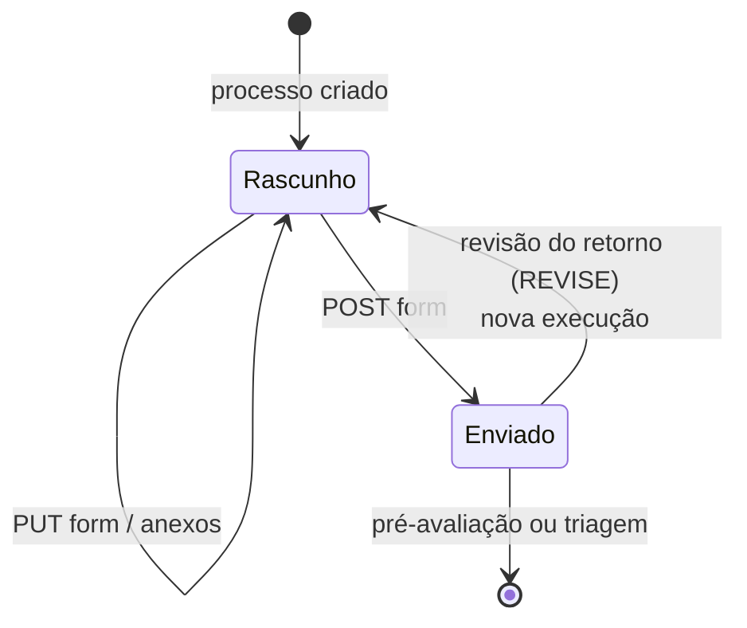

# Enviar uma proposta

Quem cria o processo vira o proponente e recebe a tarefa
`proposal_submission`. A rota base do formulário é:

```bash
FORM=$API/processes/$PID/activities/proposal_submission/form
```



## 1. Criar o processo

```bash
curl -s $API/processes/templates -H "Authorization: Bearer $TOKEN"
```

```bash
curl -s -X POST $API/processes -H "Authorization: Bearer $TOKEN" \
  -H 'Content-Type: application/json' \
  -d '{"template_key":"proof_of_concept","title":"Método 3T3 NRU"}'
```

`title` tem de 3 a 255 caracteres. O processo usa a versão publicada mais
recente do template. Os cinco templates estão em
[Templates de processo](../referencia/templates.md).

## 2. Ler o formulário

```bash
curl -s $FORM -H "Authorization: Bearer $TOKEN"
```

Traz `fields` (definição de cada campo: tipo, obrigatoriedade, opções,
seção), `values` (o que já foi salvo), `reviews` (pareceres da triagem) e
`is_submitted`.

## 3. Salvar rascunho

```bash
curl -s -X PUT $FORM -H "Authorization: Bearer $TOKEN" \
  -H 'Content-Type: application/json' \
  -d '{"values":{"method_name":"3T3 NRU","intended_purpose":"Fototoxicidade"}}'
```

O rascunho aceita valores incompletos. Valores com tipo errado respondem
`422 invalid_form_values`, com um item em `fields` por campo
(`field: values.<chave>`).

Para mudar o título junto com os valores, use as rotas do processo:

| Rota | Efeito |
|---|---|
| `PUT /processes/{id}` | Substitui `title` e `values` |
| `PATCH /processes/{id}` | Altera só o que vier; o resto do rascunho fica |

Valores inválidos aqui respondem `422 invalid_submission_values`.

## 4. Anexar arquivos

Campos do tipo `file_upload` recebem arquivo por campo:

```bash
curl -s -X POST $FORM/fields/sop_files/attachment -H "Authorization: Bearer $TOKEN" \
  -F file=@protocolo.pdf
```

| Situação | Resposta |
|---|---|
| Arquivo vazio | `400 empty_file` |
| Acima de `ATTACHMENT_MAX_SIZE_MB` (25 MB por padrão) | `413 file_too_large` |
| Extensão fora da lista do campo ou do padrão (`pdf`, `docx`, `doc`, `png`, `jpg`, `jpeg`) | `422 extension_not_allowed` |
| Campo que não é de arquivo | `422 not_a_file_field` |

`GET` na mesma rota baixa o arquivo; `DELETE` remove.

## 5. Enviar

```bash
curl -s -X POST $FORM -H "Authorization: Bearer $TOKEN" \
  -H 'Content-Type: application/json' \
  -d @valores.json
```

O envio valida todos os campos obrigatórios e anexos obrigatórios. Falha:
`422 invalid_form_values`. Sucesso:

```json
{"activity_key": "proposal_submission", "run_number": 1, "status": "COMPLETED",
 "artifact_id": "…", "pre_evaluation": null}
```

- Com avaliação por IA associada ao formulário, `pre_evaluation` traz
  `run_id` e `status`, e a triagem espera o resultado.
- Sem avaliação associada, a triagem abre na hora.

Depois do envio o formulário não muda: nova tentativa responde
`409 invalid_transition`.

## 6. Consultar versões devolvidas

```bash
curl -s $API/processes/$PID/submission-versions -H "Authorization: Bearer $TOKEN"
```

Lista as versões que foram devolvidas para revisão (pela IA ou pela triagem),
cada uma com `run_number`, conteúdo, data do envio e da devolução e a
justificativa. `GET .../submission-versions/{run_number}` traz uma delas. A
versão atual é a do formulário.

## Excluir o processo

`DELETE /processes/{id}` exclui logicamente um processo `OPEN`. Pode o
proponente ou Admin/BraCVAM. O processo vira `CANCELLED`, as tarefas e
execuções abertas são canceladas e os documentos ficam guardados.

Próximo passo: a [triagem](conduzir-a-triagem.md) ou, se houver retorno,
[responder ao retorno](responder-ao-retorno.md).
