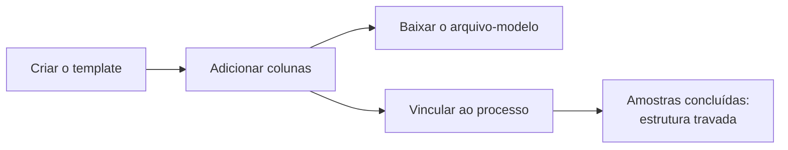

# Montar um template de coleta

O **template de coleta** define as colunas do arquivo de resultados que os
laboratórios preenchem na Etapa 3 e os mínimos de experimentos e réplicas do
ensaio. O **arquivo-modelo** é esse arquivo vazio, só com o cabeçalho, em CSV
ou Excel.

Todas as rotas exigem a permissão `collection_templates.manage`, que
Administrador e BraCVAM têm de fábrica. Sem ela, a resposta é `403
forbidden`.



Rota base: `/collection-templates`.

## 1. Criar o template

```bash
curl -s -X POST $API/collection-templates -H "Authorization: Bearer $TOKEN" \
  -H 'Content-Type: application/json' \
  -d '{"name":"Ensaio de citotoxicidade","description":"Viabilidade por MTT",
       "min_experiments":3,"min_replicates":2}'
```

`name` tem de 1 a 255 caracteres e não precisa ser único. `min_experiments`
e `min_replicates` vão de 1 a 2147483647. A resposta traz `columns: []` e
`locked: false`.

`PATCH /collection-templates/{id}` altera qualquer um desses campos.
`description: null` apaga a descrição; os outros campos não aceitam `null`.
O catálogo não tem rota para excluir um template.

## 2. Adicionar colunas

```bash
curl -s -X POST $API/collection-templates/$TID/columns \
  -H "Authorization: Bearer $TOKEN" -H 'Content-Type: application/json' \
  -d '{"key":"resultado","label":"Resultado","type":"select","required":true,
       "options":["positivo","negativo","inconclusivo"]}'
```

| Campo | Regra |
|---|---|
| `key` | Começa com letra minúscula; depois, letras minúsculas, dígitos ou `_`; até 64 caracteres. Única entre as colunas ativas. `codigo_amostra`, `experimento` e `replica` são reservadas |
| `label` | De 1 a 255 caracteres. Não entra no arquivo |
| `type` | `text`, `integer`, `decimal`, `date` ou `select` |
| `required` | Padrão `false` |
| `options` | Obrigatória e sem repetição em `select`; os outros tipos não aceitam |
| `position` | Inteiro de 1 a 2147483647, único entre as ativas. Sem ela, a coluna vai para depois da última |

`PATCH /collection-templates/{id}/columns/{column_id}` altera qualquer campo.
A API confere as regras no resultado: para trocar `select` por `text`, envie
também `options: null`. `DELETE` na mesma rota exclui a coluna e libera a
chave e a posição para uma coluna nova.

| Erro | Quando |
|---|---|
| `409 duplicate_key` | Outra coluna ativa usa a chave |
| `409 reserved_key` | Chave reservada às colunas fixas |
| `409 position_taken` | Outra coluna ativa ocupa a posição |
| `409 position_limit_reached` | Coluna sem posição, e a última coluna ativa já está em 2147483647 |
| `422 invalid_options` | `select` sem opções ou com opção repetida; outro tipo com opções |
| `422 validation_error` | Chave fora do formato, tipo desconhecido, posição fora de 1 a 2147483647 |
| `404 not_found` | Template ou coluna inexistentes, ou coluna de outro template, mesmo com o template travado |

## 3. Baixar o arquivo-modelo

```bash
curl -s -OJ "$API/collection-templates/$TID/file?format=csv" \
  -H "Authorization: Bearer $TOKEN"
```

`format` é obrigatório: `csv` ou `xlsx`. O arquivo se chama
`template-coleta-<id>.csv` ou `.xlsx` e tem uma linha só:

```text
codigo_amostra;experimento;replica;<chaves das colunas por posição>
```

O CSV sai em UTF-8 com BOM e separado por `;`, para o Excel abrir com os
acentos certos. O Excel traz uma planilha `resultados` com o cabeçalho na
linha 1.

## 4. Vincular ao processo

Quem tem a permissão informa o template ao criar o processo:

```bash
curl -s -X POST $API/processes -H "Authorization: Bearer $TOKEN" \
  -H 'Content-Type: application/json' \
  -d '{"template_key":"pre_validated_method","title":"Citotoxicidade",
       "collection_template_id":"'$TID'"}'
```

Sem a permissão, o campo gera `403 forbidden`, mesmo que o template não
exista. Com a permissão, um template inexistente gera `404 not_found`. O
vínculo aparece em `collection_template_id` na consulta e na listagem de
processos e no `PROCESS_CREATED` da linha do tempo. Nenhuma rota o altera
depois.

## Quando o template trava

O template trava quando um processo vinculado conclui a definição das
amostras. A partir daí, `locked` vale `true` e as mudanças estruturais
respondem `409 template_locked`:

- criar, alterar ou excluir coluna;
- mudar `min_experiments` ou `min_replicates` para um valor diferente do
  atual.

O nome, a descrição, a consulta e o download continuam liberados. Reenviar
os mínimos com o valor atual também passa, para o frontend poder mandar o
objeto inteiro.

O template não destrava: a definição das amostras não reabre, e um processo
encerrado, arquivado ou excluído continua contando. Se a conclusão das
amostras e uma mudança estrutural chegam juntas, a API processa uma depois da
outra. Se a conclusão vem primeiro, a mudança é recusada.

Rotas e erros completos: [Rotas](../referencia/rotas.md#templates-de-coleta)
e [Erros](../referencia/erros.md#codigos).
