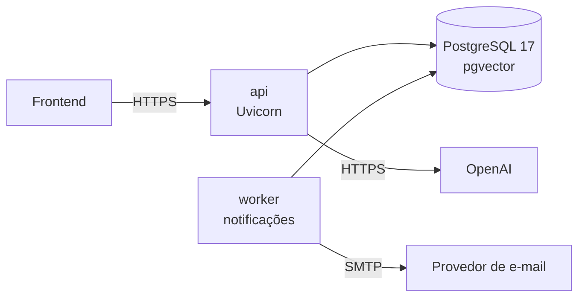

# Operar em produção

## Serviços



| Serviço | Imagem | Função |
|---|---|---|
| `api` | `Dockerfile` do repositório | API. O `entrypoint.sh` roda `alembic upgrade head` e `python -m pivma.bootstrap_system` antes do Uvicorn |
| `worker` | A mesma imagem | `python -m pivma.notifications.worker`. Sem ele, nenhum e-mail sai |
| `db` | `pgvector/pgvector:pg17` | Banco |

A imagem instala as dependências pelo `uv.lock`, sem o grupo `dev`.

## Configuração mínima

| Variável | Produção |
|---|---|
| `DATABASE_URL` | Banco de produção |
| `JWT_SECRET_KEY` | Aleatória, 32 bytes ou mais |
| `AUTH_ALLOWED_ORIGINS` | Só as origens HTTPS do frontend |
| `AI_PROVIDER`, `OPENAI_API_KEY` | `openai` e a chave |
| `NOTIFICATION_EMAIL_BACKEND` | `smtp` |
| `SMTP_*`, `NOTIFICATION_FROM_ADDRESS` | Provedor de e-mail |
| `NOTIFICATION_ENCRYPTION_KEY` | Chave Fernet (gerar abaixo) |
| `INVITE_URL_TEMPLATE`, `PASSWORD_RESET_URL_TEMPLATE` | Páginas do frontend, com `{token}` |
| `SAMPLE_QR_BASE_URL` | Endereço público do frontend |

Lista completa em [Variáveis de ambiente](../referencia/ambiente.md).

```bash
python -c "from cryptography.fernet import Fernet; print(Fernet.generate_key().decode())"
```

Trocar a chave com envios pendentes faz esses envios falharem como `decrypt`.

## E-mail

- Qualquer provedor SMTP serve (SES, Brevo, Postmark, Mailgun…): é trocar as
  variáveis `SMTP_*`. `SMTP_SECURITY`: `starttls` (porta 587), `ssl` (465) ou
  `none`.
- O sistema só envia. O domínio do remetente precisa de SPF, DKIM e DMARC.
- Sem `NOTIFICATION_EMAIL_BACKEND`, convites por e-mail respondem
  `409 channel_unavailable` e a recuperação de senha não envia nada (o log
  registra `password_reset_unavailable`).

## Anexos

Os arquivos ficam em `ATTACHMENTS_DIR` (`var/attachments` por padrão), no
disco do contêiner. Monte um volume nesse caminho para não perdê-los ao
recriar o contêiner.

## Atualizar

```bash
docker compose up -d --build api worker
```

A API aplica as migrações e o provisionamento na subida. Recrie também o
`worker`, que usa a mesma imagem.

## Observar

| O quê | Onde |
|---|---|
| Logs da aplicação | Arquivos JSONL em `application/` e `ai/`, com rotação diária e 7 dias de retenção. O diretório `logs/` é calculado a partir do pacote instalado: no desenvolvimento, `logs/` na raiz do repositório; na imagem, `/app/.venv/lib/python3.14/logs` |
| Saída do servidor | `docker compose logs -f api` e `docker compose logs -f worker` |
| Envios com falha | `delivery.error_code` do convite e o evento `NOTIFICATION_FAILED` na linha do tempo do processo (envios de recuperação de senha não têm processo) |
| Pré-avaliações presas | Na subida, a API marca como falha as execuções que ficaram em andamento |
