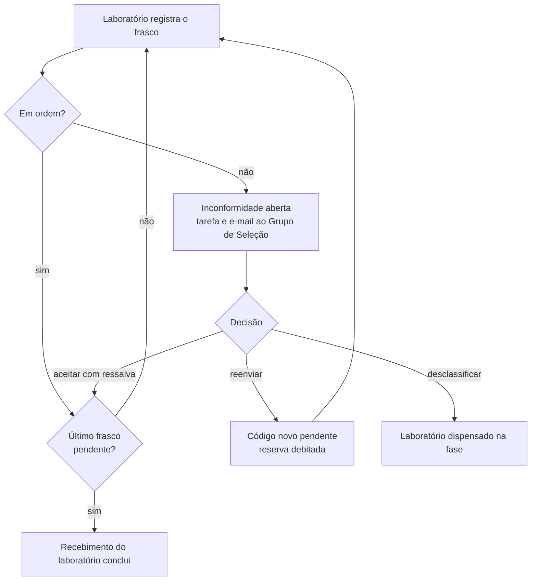

# Receber amostras

Quando a definição das amostras conclui, a atividade `sample_receipt` abre
uma execução para cada laboratório congelado. O laboratório participante
registra cada frasco que chega. Um frasco fora de ordem vira uma
inconformidade, que só o Grupo de Seleção de Amostras decide.



Rota base: `/processes/{id}/sample-receipt`.

## Laboratório: ver os próprios frascos

```bash
curl -s $API/processes/$PID/sample-receipt/vials -H "Authorization: Bearer $TOKEN"
```

Lista paginada dos frascos dos laboratórios pelos quais você é participante
efetivo, por laboratório e código. Cada item traz `status`, lote, instruções
de manuseio, pictogramas GHS, regime e faixa de temperatura, o registro
(`receipt`), as fotos e, depois da decisão do Grupo de Seleção, a orientação
dele ao laboratório (`lab_guidance`). Frascos de outros laboratórios nunca aparecem, nem
na busca: `?search=K2Z4` filtra por trecho do código, sem diferenciar
maiúsculas.

| `status` | Significado |
|---|---|
| `pending` | Ainda não registrado |
| `received` | Registrado em ordem |
| `awaiting_decision` | Registrado fora de ordem; o Grupo de Seleção vai decidir |
| `accepted_with_caveat` | Aceito com ressalva; conta como recebido |
| `replaced` | Um frasco novo, com outro código, vai substituí-lo |
| `disqualified` | O laboratório foi desclassificado na fase |

O destino do QR é `GET /processes/{id}/samples/vials/{code}`, com os mesmos
dados cegos de um frasco só.

## Laboratório: conferir antes de confirmar

```bash
curl -s -X POST $API/processes/$PID/sample-receipt/vials/$CODE/check \
  -H "Authorization: Bearer $TOKEN" -H 'Content-Type: application/json' \
  -d '{"opened_at":"2026-10-04T09:30:00Z","temperature_celsius":21.0,
       "package_state":"intact"}'
```

Recebe o mesmo corpo do registro e recusa o que o registro recusaria, mas não
grava nada. Responde `conforming`, `deviations` e uma `message` para a tela
mostrar antes da confirmação: dentro do padrão, ou fora do padrão com os
motivos e a faixa esperada, avisando que uma inconformidade será registrada e
a equipe das amostras avisada. Com campos válidos, a tela pode liberar o
botão de confirmar.

## Laboratório: registrar um frasco

```bash
curl -s -X POST $API/processes/$PID/sample-receipt/vials/$CODE \
  -H "Authorization: Bearer $TOKEN" -H 'Content-Type: application/json' \
  -d '{"opened_at":"2026-10-04T09:30:00Z","temperature_celsius":4.5,
       "package_state":"intact","notes":"Gelo preservado."}'
```

| Campo | Regra |
|---|---|
| `opened_at` | Obrigatório, data e hora de abertura da caixa, não futura |
| `temperature_celsius` | Obrigatório, número em °C |
| `package_state` | Obrigatório: `intact`, `damaged` ou `violated` |
| `notes` | Opcional |

O frasco fica em ordem com embalagem `intact` e temperatura dentro da faixa
da substância, limites incluídos. Sem faixa cadastrada, a temperatura não
gera problema. Fora de ordem, a resposta continua `201`, com
`conforming: false`, os motivos em `deviations` (`temperature_out_of_range`,
`package_damaged`, `package_violated`) e uma mensagem para a tela pedir que o
material fique segregado.

`laboratory_receipt_status` diz como fica o lote:

| Valor | Quando |
|---|---|
| `completed` | Todo frasco ativo está em ordem ou aceito com ressalva; a tarefa conclui |
| `awaiting_decision` | Há frasco esperando decisão |
| `in_progress` | Há frasco pendente |

O registro não muda depois de gravado.

| Erro | Quando |
|---|---|
| `422 validation_error` | Campo ausente ou inválido, um item por campo em `fields` |
| `404 not_found` | Código de outro laboratório, inexistente ou substituído |
| `409 vial_already_registered` | O frasco já tem registro |
| `409 invalid_transition` | Recebimento do laboratório fora de andamento (concluído, dispensado) ou processo encerrado |

## Laboratório: anexar fotos

```bash
curl -s -X POST $API/processes/$PID/sample-receipt/vials/$CODE/photos \
  -H "Authorization: Bearer $TOKEN" -F file=@frasco.jpg
```

PNG ou JPG, até `ATTACHMENT_MAX_SIZE_MB`, em frasco já registrado e com o
recebimento do laboratório em andamento. O download,
`GET /processes/{id}/sample-receipt/photos/{photo_id}`, vale para o
laboratório do frasco e para o Grupo de Seleção.

## Grupo de Seleção: ver as inconformidades

A primeira inconformidade abre a tarefa "Resolver problemas no recebimento de
amostras" (`sample_receipt_resolution`) e cada pessoa do Grupo recebe um
e-mail, quando o envio está configurado.

```bash
curl -s "$API/processes/$PID/sample-receipt/nonconformities?status=open" \
  -H "Authorization: Bearer $TOKEN"
```

Cada item traz o texto do alerta (`alert`, ex.: "Alerta de Recebimento: o
laboratório Lab A registrou desvio térmico no frasco K2Z43SQ3."), laboratório,
código, substância (com a reserva), faixa esperada, o registro, as fotos, os
motivos e, depois da decisão, quem decidiu, a justificativa, a orientação ao
laboratório e o código novo.
`status` filtra por `open` ou `resolved`. Não há central de notificações: a
tarefa e esta lista são o aviso dentro da plataforma.

## Grupo de Seleção: decidir

```bash
curl -s -X POST $API/processes/$PID/sample-receipt/nonconformities/$NC_ID/decision \
  -H "Authorization: Bearer $TOKEN" -H 'Content-Type: application/json' \
  -d '{"decision":"resend","justification":"Frasco reserva despachado em 05/10.",
       "lab_guidance":"Descarte o frasco antigo como resíduo químico."}'
```

| `decision` | Efeito |
|---|---|
| `accept_with_caveat` | O frasco conta como recebido. Se era o último, o recebimento do laboratório conclui |
| `resend` | Debita um frasco da reserva da substância e gera um código novo para o mesmo laboratório. Imprima a etiqueta nova em `GET /processes/{id}/samples/labels` |
| `disqualify` | Dispensa o laboratório na Etapa 3, com a justificativa como motivo, e encerra as outras inconformidades abertas dele |

A justificativa é obrigatória e o laboratório não a vê. Para orientar o
laboratório, use `lab_guidance`, opcional: o laboratório lê esse texto no
frasco decidido. Não escreva nele nada que ligue o frasco antigo ao novo nem
que revele a substância. Texto em branco conta como ausente. Na
desclassificação, a orientação vai para todas as inconformidades que a
decisão encerra.

Com o envio de e-mail configurado, cada pessoa com designação efetiva pelo
laboratório do frasco recebe um e-mail com a situação do frasco e a
orientação, sem a justificativa nem o código novo. Quando não resta
inconformidade aberta no processo, a tarefa de resolução conclui.

| Erro | Quando |
|---|---|
| `422 validation_error` | Decisão fora da lista ou justificativa vazia |
| `404 not_found` | Inconformidade de outro processo ou inexistente |
| `409 already_decided` | Inconformidade já decidida |
| `409 no_reserve_vials` | Reenvio com reserva zero; aceite com ressalva ou desclassifique |

Por que o reenvio troca o código: [Amostras cegas](../explicacao/amostras-cegas.md#o-reenvio-troca-o-codigo).
