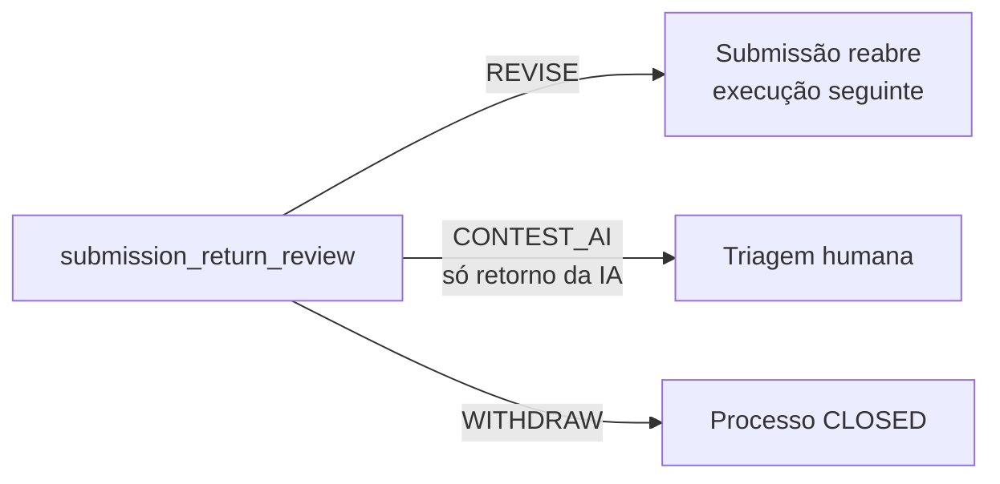

# Responder ao retorno

O proponente recebe a tarefa `submission_return_review` quando:

- a pré-avaliação por IA termina negativa ou com falha; ou
- a triagem pede revisão (`NEEDS_REVISION`).

Enquanto a revisão está aberta, a submissão fica travada.



## 1. Ler o retorno

```bash
curl -s $API/processes/$PID/return-review -H "Authorization: Bearer $TOKEN"
```

A resposta traz a origem do retorno (resultado da IA ou decisão da triagem
com a justificativa) e as escolhas disponíveis para aquele retorno.

## 2. Escolher

```bash
curl -s -X POST $API/processes/$PID/return-review -H "Authorization: Bearer $TOKEN" \
  -H 'Content-Type: application/json' -d '{"choice":"REVISE"}'
```

| `choice` | Efeito |
|---|---|
| `REVISE` | Abre uma nova execução de `proposal_submission` com os valores anteriores. Envie de novo pelo [formulário](enviar-uma-proposta.md); o `run_number` sobe |
| `CONTEST_AI` | Só em retorno da IA. Encaminha a submissão à triagem humana sem alterá-la |
| `WITHDRAW` | Encerra o processo como `CLOSED` |

A escolha vale uma vez por retorno: a segunda responde `409`. Se um
administrador reprocessar uma pré-avaliação que falhou
(`POST /admin/pre-evaluations/{run_id}/retry`), a revisão aberta é cancelada.
