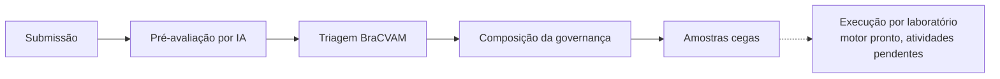

# pi\*VMA

A pi\*VMA (Plataforma Inteligente de Validação de Métodos Alternativos) apoia o
BraCVAM na validação de métodos alternativos ao uso de animais. Este backend
expõe a API usada pelo frontend: contas e acessos, submissão de métodos,
pré-avaliação por IA, triagem, composição da governança do estudo e
preparação de amostras cegas.

Esta documentação descreve **o que o sistema faz hoje**. O histórico de cada
mudança fica nas specs (`specs/`), e os requisitos de origem ficam em
`docs/` (plano de trabalho e guia do protótipo).



## Como esta documentação está organizada

| Seção | Para quê | Comece por |
|---|---|---|
| [Tutorial](tutorial/index.md) | Aprender pelas histórias: triagem, ajustes, IA, equipe e amostras | [Do cadastro à triagem](tutorial/primeiro-processo.md) |
| [Guias](guias/index.md) | Resolver uma tarefa específica | [Autenticar no frontend](guias/autenticar-no-frontend.md) |
| [Referência](referencia/index.md) | Consultar contratos, códigos e valores | [Rotas](referencia/rotas.md), [Erros](referencia/erros.md) |
| [Explicação](explicacao/index.md) | Entender como e por que funciona | [Escopo atual](explicacao/escopo.md) |

## Atores

| Ator | Como recebe o acesso | O que faz |
|---|---|---|
| Usuário sem perfil | Cadastro público | Cria processos (vira `proponent`) e aceita convites |
| Proponente | Cargo `proponent` no processo que criou | Envia a proposta, responde ao retorno, designa patrocinador e Grupo Gestor |
| BraCVAM | Perfil global `BraCVAM` | Configura a IA, conduz a triagem, vê todos os processos |
| Administrador | Perfil global `Administrador` | Gere contas, perfis, catálogo institucional; vê todos os processos |
| Grupo Gestor | Cargo `group_manager` no processo | Designa os demais participantes, dispensa e reabre execuções de laboratório |
| Grupo de Seleção de Amostras | Cargo `sample_selection_group` | Cadastra substâncias, SDS e gera os códigos cegos |
| Laboratório participante | Cargo `participating_laboratory` com vínculo ao laboratório | Executa as atividades do próprio laboratório |

Detalhes em [Autorização](explicacao/autorizacao.md) e
[Perfis, permissões e cargos](referencia/perfis-permissoes-cargos.md).

## Gerar este site

```bash
poetry install --with docs
```

```bash
poetry run poe docs-serve
```

Com uv: `uv sync --group docs` e `uv run poe docs-serve`. O site abre em
`http://localhost:8008`.
