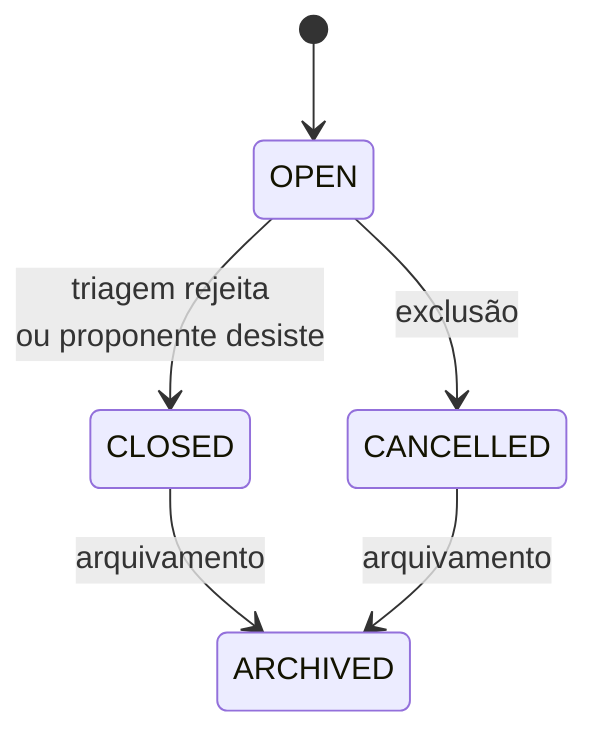
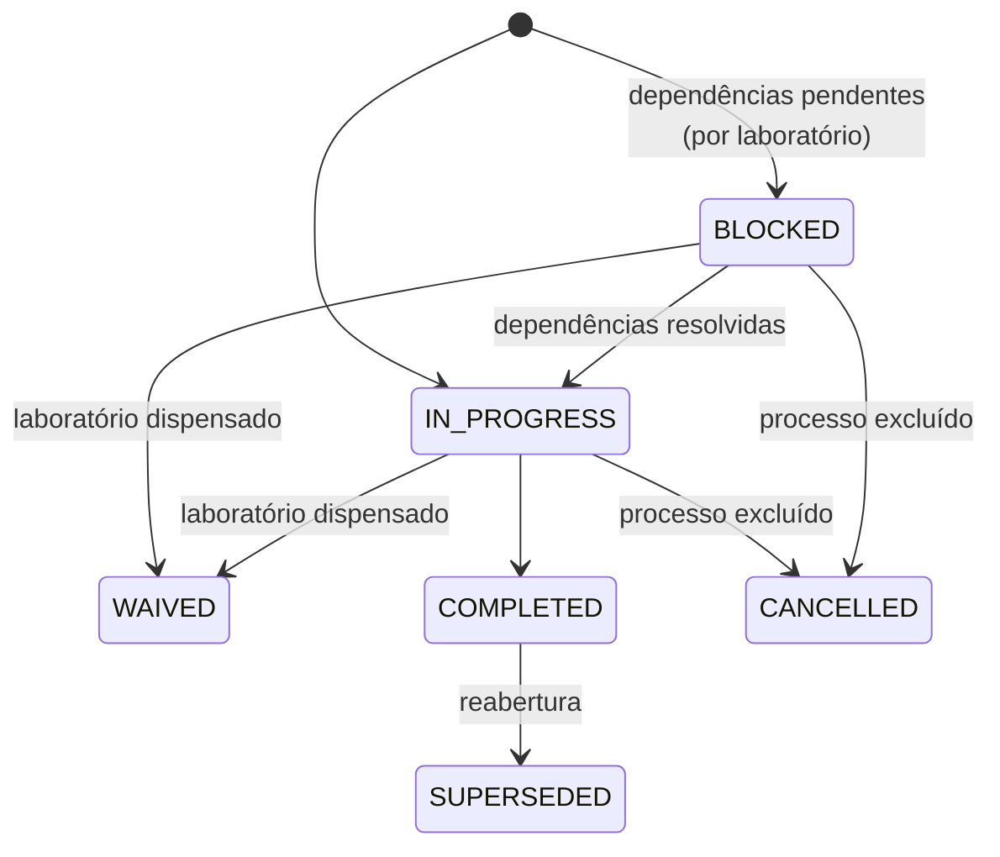

# Estados

## Processo (`status`)

Guarda só o ciclo de vida. A posição no fluxo vem das fases e atividades.

| Valor | Significado | Muda por |
|---|---|---|
| `OPEN` | Em andamento | Criação |
| `CLOSED` | Encerrado | `REJECTED` na triagem; `WITHDRAW` na revisão do retorno |
| `CANCELLED` | Excluído logicamente | `DELETE /processes/{id}` (proponente ou Admin/BraCVAM) |
| `ARCHIVED` | Arquivado | `PATCH /processes/{id}/archive` (`triage.review`) |

Um `CHECK` no banco aceita só esses quatro valores. `CLOSED`, `CANCELLED` e
`ARCHIVED` não aceitam mutações (`409`).

## Fase

| Valor | Significado |
|---|---|
| `NOT_STARTED` | Nenhuma atividade aberta ainda |
| `IN_PROGRESS` | Alguma atividade aberta |
| `COMPLETED` | Fase concluída |
| `CANCELLED` | Cancelada pela exclusão do processo |

## Atividade

| Valor | Significado |
|---|---|
| `BLOCKED` | Esperando dependências |
| `IN_PROGRESS` | Aberta; pode haver várias ao mesmo tempo no processo |
| `COMPLETED` | Concluída |
| `CANCELLED` | Cancelada pela exclusão do processo |

## Execução de atividade

Cada atividade tem uma ou mais execuções (`run_number`). Uma revisão do
retorno ou uma reabertura cria a execução seguinte.

| Valor | Significado |
|---|---|
| `IN_PROGRESS` | Aberta, com tarefa |
| `BLOCKED` | Execução de laboratório esperando a anterior do mesmo laboratório; sem tarefa |
| `COMPLETED` | Concluída |
| `CANCELLED` | Cancelada |
| `WAIVED` | Laboratório dispensado pelo gestor |
| `SUPERSEDED` | Substituída por uma reabertura; dados preservados |

## Tarefa

| Valor | Significado |
|---|---|
| `READY` | Aberta, para o cargo da atividade |
| `COMPLETED` | Concluída |
| `CANCELLED` | Cancelada |

## Convite

| Valor | Significado |
|---|---|
| `pending` | Esperando aceite |
| `accepted` | Aceito; virou designação |
| `revoked` | Revogado |

Convite pendente com prazo vencido responde `409 invite_expired`.

## Envio de notificação

| Valor | Significado |
|---|---|
| `pending` | Na fila do worker |
| `sent` | Aceito pelo servidor SMTP |
| `failed` | Falhou; ver `error_code` |
| `cancelled` | Cancelado (convite aceito ou revogado, novo pedido de senha) |

`error_code`: `smtp_permanent`, `smtp_temporary`, `connection`,
`max_attempts`, `expired`, `decrypt`, `cancelled_*`.

## Pré-avaliação por IA

| Execução | Resultado consolidado |
|---|---|
| `in_progress`, `completed`, `failed`, `CANCELLED` (processo excluído) | `positive`, `negative` |

Conclusão de cada critério: `compliant`, `non_compliant`, `partial`,
`indeterminate`.
