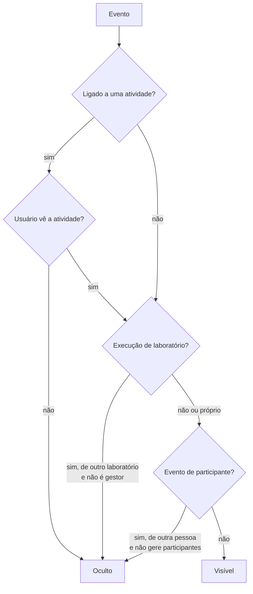

# Eventos da linha do tempo

`GET /processes/{id}/timeline` lista os eventos de auditoria do processo, do
mais antigo ao mais recente, no [envelope de listagem](listagens-e-referencias.md).
Cada evento traz `event_type`, `user_id`, `activity_run_id`, `occurred_at` e
`context_data`.

Mudanças de perfis e do catálogo institucional não ficam aqui: elas têm os
próprios históricos (`GET /rbac/changes`, `GET /institutional/changes`).

## Quem vê cada evento

- `LABORATORY_WAIVED` só aparece para o gestor do processo.
- A paginação é feita depois do filtro: o total conta só o que o usuário vê.

## Tipos

| Grupo | `event_type` |
|---|---|
| Processo | `PROCESS_CREATED`, `PROCESS_DELETED`, `PROCESS_ARCHIVED`, `PROCESS_WITHDRAWN` |
| Atividades | `ACTIVITY_UNBLOCKED` |
| Submissão | `FORM_DRAFT_SAVED`, `FORM_ATTACHMENT_UPLOADED`, `FORM_ATTACHMENT_REMOVED`, `SUBMISSION_UPDATED`, `SUBMISSION_SUBMITTED` |
| Pré-avaliação por IA | `AI_PRE_EVALUATION_STARTED`, `AI_PRE_EVALUATION_COMPLETED`, `AI_PRE_EVALUATION_FAILED`, `AI_CRITERION_FEEDBACK_RECORDED`, `DIRECT_REVIEW_REQUESTED` |
| Triagem | `FIELD_REVIEWED`, `TRIAGE_APPROVED`, `TRIAGE_REJECTED`, `REVISION_REQUESTED` |
| Revisão do retorno | `RETURN_REVIEW_OPENED`, `RETURN_REVIEW_DECIDED` |
| Participantes | `PARTICIPANT_ASSIGNED`, `PARTICIPANT_REVOKED`, `CONFLICT_DECLARED`, `PARTICIPANT_EFFECTIVENESS_LOST`, `PARTICIPANT_EFFECTIVENESS_RESTORED` |
| Convites | `INVITE_CREATED`, `INVITE_RESENT`, `INVITE_REVOKED`, `INVITE_ACCEPTED` |
| Amostras cegas | `SAMPLE_SUBSTANCE_REGISTERED`, `SAMPLE_SUBSTANCE_UPDATED`, `SAMPLE_SUBSTANCE_REMOVED`, `SAMPLE_SDS_UPLOADED`, `SAMPLE_SDS_DOWNLOADED`, `SAMPLE_CODES_GENERATED`, `SAMPLE_DEFINITION_COMPLETED` |
| Execução por laboratório | `LABORATORY_RUN_COMPLETED`, `LABORATORY_WAIVED`, `LABORATORY_RUN_REOPENED` |
| Notificações | `NOTIFICATION_SENT`, `NOTIFICATION_FAILED`, `NOTIFICATION_CANCELLED` |

## Contexto relevante

| Evento | `context_data` |
|---|---|
| `REVISION_REQUESTED` | `source`: `AI_PRE_EVALUATION` ou `TRIAGE` |
| `PARTICIPANT_EFFECTIVENESS_LOST` / `_RESTORED` | `reason`: `affiliation_ended`, `laboratory_deactivated`, `institution_deactivated`, `affiliation_created` |
| `LABORATORY_*` | `laboratory_id` |
| `SAMPLE_*` | Só identificadores e contagens; nunca nome químico, CAS ou código |
| `NOTIFICATION_*` | `notification_id`, `kind`, `channel`; nunca destinatário ou conteúdo |

Eventos de efetividade só são gravados em processos em andamento.
