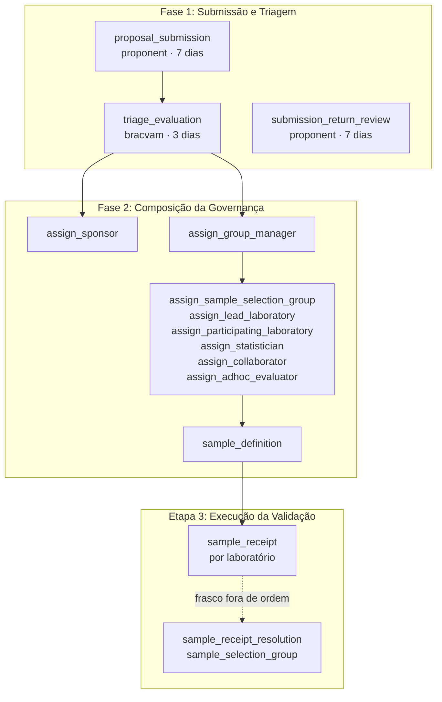

# Templates de processo

Cinco templates vêm com o sistema, em `src/pivma/templates_data/`, e são
carregados pelo provisionamento. Um processo usa a versão publicada mais
recente do template na criação e fica nela até o fim.

| `key` | Nome | Versão | Formulário de submissão |
|---|---|---|---|
| `pre_validated_method` | Método Pré-Validado | 4 | `submission_pre_validated_v1` (1 campo) |
| `scope_extension` | Extensão de Escopo de Aplicação | 4 | `submission_scope_extension_v1` (1 campo) |
| `me_too_validation` | Validação Me-Too | 4 | `submission_me_too_v1` (1 campo) |
| `validated_method_dossier` | Método Validado – Dossiê Submetido | 6 | `submission_validated_dossier_v1` (2 campos) |
| `proof_of_concept` | Prova de Conceito (PoC) | 4 | `submission_proof_of_concept_v1` (formulário completo) |

Os cinco têm as mesmas fases e atividades. Mudam os formulários.

## Fases e atividades

| Atividade | Fase | Tipo | Edita | Depende de | Prazo |
|---|---|---|---|---|---|
| `proposal_submission` | 1 | `form` | `proponent` | — | 168 h |
| `triage_evaluation` | 1 | `form` (sem formulário; decisão própria) | `bracvam` | `proposal_submission` | 72 h |
| `submission_return_review` | 1 | `return_review` | `proponent` | aberta pela IA ou pela triagem | 168 h |
| `assign_sponsor` | 2 | `role_assignment` | `proponent` | `triage_evaluation` | — |
| `assign_group_manager` | 2 | `role_assignment` | `proponent` | `triage_evaluation` | — |
| `assign_sample_selection_group` | 2 | `role_assignment` | `group_manager` | `assign_group_manager` | — |
| `assign_lead_laboratory` | 2 | `role_assignment` | `group_manager` | `assign_group_manager` | — |
| `assign_participating_laboratory` | 2 | `role_assignment` | `group_manager` | `assign_group_manager` | — |
| `assign_statistician` | 2 | `role_assignment` | `group_manager` | `assign_group_manager` | — |
| `assign_collaborator` | 2 | `role_assignment` | `bracvam` | `assign_group_manager` | — |
| `assign_adhoc_evaluator` | 2 | `role_assignment` | `bracvam` | `assign_group_manager` | — |
| `sample_definition` | 2 | `sample_definition` | `sample_selection_group` | `assign_sample_selection_group` e `assign_participating_laboratory` | — |
| `sample_receipt` | 3 | `sample_receipt`, por laboratório | `participating_laboratory` | `sample_definition` | — |
| `sample_receipt_resolution` | 3 | `sample_receipt_resolution` | `sample_selection_group` | aberta quando um laboratório registra um frasco fora de ordem | — |

Nenhuma atividade dos templates lista cargos em `view`: cada atividade é vista
pelos cargos que a editam, por Admin e por BraCVAM.

`sample_receipt` é a única atividade executada por laboratório: cada
laboratório congelado em `sample_definition` ganha a própria execução. Veja
[Isolamento por laboratório](../explicacao/isolamento-por-laboratorio.md) e
[Receber amostras](../guias/receber-amostras.md).

## Consultar pela API

| Rota | Conteúdo |
|---|---|
| `GET /processes/templates` | Templates ativos |
| `GET /processes/templates/{key}` | Definição da versão: fases, atividades, formulários |
| `GET /processes/templates/{key}/forms/{form_key}` | Campos de um formulário |
