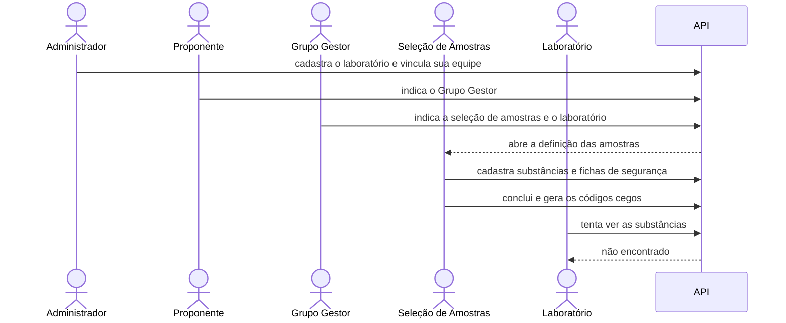

# Montar a equipe e preparar as amostras

Depois da triagem, o estudo precisa de gente: um Grupo Gestor para coordenar,
um grupo que escolhe as substâncias e os laboratórios que vão testá-las.
Neste tutorial a equipe é montada e as amostras são preparadas de forma cega:
os laboratórios recebem frascos com códigos, sem saber o que há dentro.



## Os personagens

- **Administrador**: mantém o cadastro de instituições e laboratórios.
- **Proponente**: indica quem vai gerir o estudo.
- **Grupo Gestor**: monta o restante da equipe.
- **Grupo de Seleção de Amostras**: único que conhece as substâncias.
- **Laboratório participante**: vai testar as amostras sem saber o que são.

## Antes de começar

Faça o tutorial [Do cadastro à triagem](primeiro-processo.md) inteiro. Este
tutorial continua aquele processo, que já está na Fase 2. Recupere o processo:

??? example "Como fazer pela API"
    ```bash
    PROP=$(login proponente senha-segura-123)
    PID=$(curl -s "$API/processes" -H "Authorization: Bearer $PROP" \
      | jq -r '.data[] | select(.title=="Método 3T3 NRU") | .id')
    echo $PID
    ```

## 1. As novas pessoas criam suas contas

A gestora do estudo, a responsável pela seleção de amostras e o técnico do
laboratório se cadastram.

??? example "Como fazer pela API"
    ```bash
    signup() {
      curl -s -X POST $API/users -H 'Content-Type: application/json' \
        -d "{\"username\":\"$1\",\"email\":\"$1@example.com\",\"full_name\":\"Usuário $1\",\"password\":\"senha-segura-123\"}" \
        | jq -r .id
    }
    GESTORA_ID=$(signup gestora)
    SELECAO_ID=$(signup selecao)
    TECNICO_ID=$(signup tecnico)
    ```

## 2. O administrador cadastra o laboratório

Um laboratório só participa do estudo se estiver no cadastro da plataforma e
se quem trabalha nele estiver vinculado a ele. O administrador cria a
instituição, o laboratório e vincula o técnico.

??? example "Como fazer pela API"
    ```bash
    ADMIN=$(login admin@example.com admin-senha-123)
    INST=$(curl -s -X POST $API/institutional/institutions -H "Authorization: Bearer $ADMIN" \
      -H 'Content-Type: application/json' -d '{"name":"Instituto Exemplo"}' | jq -r .id)
    LAB=$(curl -s -X POST $API/institutional/laboratories -H "Authorization: Bearer $ADMIN" \
      -H 'Content-Type: application/json' \
      -d "{\"institution_id\":\"$INST\",\"name\":\"Laboratório de Toxicologia\"}" | jq -r .id)
    curl -s -X POST $API/institutional/users/$TECNICO_ID/affiliations -H "Authorization: Bearer $ADMIN" \
      -H 'Content-Type: application/json' \
      -d "{\"institution_id\":\"$INST\",\"laboratory_id\":\"$LAB\"}" -o /dev/null -w '%{http_code}\n'
    ```

    O vínculo responde `201`.

## 3. O proponente indica o Grupo Gestor

O proponente tem duas tarefas abertas desde a triagem. Ele indica a gestora
para o Grupo Gestor. A tarefa correspondente se fecha sozinha, e a gestora
passa a ver o processo.

??? example "Como fazer pela API"
    ```bash
    curl -s -X POST $API/processes/$PID/participants -H "Authorization: Bearer $PROP" \
      -H 'Content-Type: application/json' \
      -d "{\"user_id\":\"$GESTORA_ID\",\"role_key\":\"group_manager\"}" -o /dev/null -w '%{http_code}\n'
    ```

## 4. A gestora monta a equipe

A gestora recebe as tarefas de indicar o restante da equipe. Ela indica a
responsável pela seleção de amostras e o técnico como laboratório
participante, apontando o laboratório dele.

Se ela tentasse indicar alguém sem vínculo com o laboratório, a plataforma
recusaria.

??? example "Como fazer pela API"
    ```bash
    GM=$(login gestora senha-segura-123)
    curl -s "$API/tasks?process_id=$PID&status=READY" -H "Authorization: Bearer $GM" \
      | jq '.data[] | .activity_key'
    curl -s -X POST $API/processes/$PID/participants -H "Authorization: Bearer $GM" \
      -H 'Content-Type: application/json' \
      -d "{\"user_id\":\"$SELECAO_ID\",\"role_key\":\"sample_selection_group\"}" -o /dev/null -w '%{http_code}\n'
    curl -s -X POST $API/processes/$PID/participants -H "Authorization: Bearer $GM" \
      -H 'Content-Type: application/json' \
      -d "{\"user_id\":\"$TECNICO_ID\",\"role_key\":\"participating_laboratory\",\"laboratory_id\":\"$LAB\"}" \
      -o /dev/null -w '%{http_code}\n'
    ```

## 5. A seleção de amostras cadastra as substâncias

Com a equipe formada, a responsável pela seleção recebe a tarefa de definir
as amostras. Ela cadastra cada substância com nome, número CAS, lote,
instruções de manuseio e a classificação de referência, o resultado já
conhecido da substância no ensaio. Informa também como conservar o frasco
(refrigerado) e quantos frascos guarda de reserva. Depois anexa a ficha de
segurança (SDS) em PDF.

A cada cadastro, a plataforma já gera um código cego para cada laboratório
participante.

??? example "Como fazer pela API"
    ```bash
    SEL=$(login selecao senha-segura-123)
    curl -s "$API/tasks?process_id=$PID&status=READY" -H "Authorization: Bearer $SEL" \
      | jq '.data[] | .activity_key'
    SUB=$(curl -s -X POST $API/processes/$PID/samples -H "Authorization: Bearer $SEL" \
      -H 'Content-Type: application/json' \
      -d '{"chemical_name":"Formaldeído","cas_number":"50-00-0","lot":"L-2026-04",
           "safe_handling_instructions":"Tóxico por inalação. Usar luvas e capela.",
           "reference_classification":"Severamente irritante / Categoria 1",
           "storage_temperature_regime":"refrigerated","reserve_vials_count":1,
           "ghs_hazard_pictograms":["GHS05","GHS06","GHS08"]}' \
      | jq -r .id)
    printf '%%PDF-1.4\n%%%%EOF\n' > sds.pdf
    curl -s -X PUT $API/processes/$PID/samples/$SUB/sds -H "Authorization: Bearer $SEL" \
      -F file=@sds.pdf -o /dev/null -w '%{http_code}\n'
    ```

    A tarefa é `sample_definition`.

## 6. A seleção conclui e imprime as etiquetas

Quando todas as substâncias têm ficha, a seleção conclui a etapa. A lista de
laboratórios fica congelada e as amostras não mudam mais. As etiquetas trazem
só o código, o lote e um QR. Nenhuma delas mostra o nome da substância.

??? example "Como fazer pela API"
    ```bash
    curl -s -X POST $API/processes/$PID/samples/complete -H "Authorization: Bearer $SEL" \
      -o /dev/null -w '%{http_code}\n'
    curl -s $API/processes/$PID/samples/labels -H "Authorization: Bearer $SEL" \
      | jq '.data[] | {code, lot, laboratory: .laboratory.name}'
    ```

## 7. O laboratório não vê o que há nos frascos

O técnico do laboratório participa do processo, mas não consegue ver as
substâncias. Para ele, a lista de substâncias não existe. Ele só vê os
frascos do próprio laboratório, pelo código, quando eles chegam:
[Quando um frasco chega com problema](recebimento-com-avaria.md).

??? example "Como fazer pela API"
    ```bash
    TEC=$(login tecnico senha-segura-123)
    curl -s $API/processes/$PID/samples -H "Authorization: Bearer $TEC" -o /dev/null -w '%{http_code}\n'
    ```

    Resposta: `404`.

## O que você viu

- O proponente indica só o gestor; o gestor monta o resto da equipe.
- Laboratórios precisam estar cadastrados e ter pessoas vinculadas.
- Só o Grupo de Seleção conhece as substâncias.
- Cada laboratório recebe códigos próprios, sem nada que identifique o
  conteúdo.

Mais detalhes: [Amostras cegas](../explicacao/amostras-cegas.md) e
[Designar participantes](../guias/designar-participantes.md).
