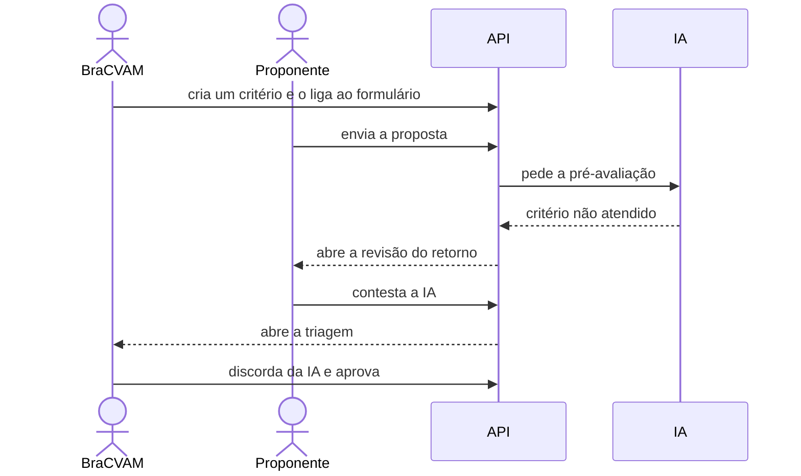

# Quando a IA reprova a proposta

O BraCVAM pode pedir que a IA leia cada proposta antes da triagem. Neste
tutorial a IA aponta um problema, o proponente discorda e contesta, e a
decisão volta para uma pessoa. A IA ajuda a filtrar, mas quem decide é sempre
o triador.



## Os personagens

- **Triador do BraCVAM**: configura o que a IA deve verificar e decide a
  triagem.
- **Proponente**: dono da proposta.
- **IA**: lê a proposta e diz, critério a critério, se ela atende.

## Antes de começar

Faça o tutorial [Do cadastro à triagem](primeiro-processo.md) até o passo 5.
O ambiente usa a IA de teste (`AI_PROVIDER="fake"`): ela considera um critério
atendido quando palavras do enunciado aparecem no texto da proposta. Assim o
resultado é previsível e não há custo.

## 1. O BraCVAM define o que a IA deve verificar

O triador cria uma avaliação com um critério em linguagem natural: "Deve
conter cronograma financeiro aprovado". Depois publica e liga a avaliação ao
campo de terminologia do formulário do dossiê. A partir daí, toda proposta
desse tipo passa pela IA.

??? example "Como fazer pela API"
    ```bash
    BRAC=$(login triador senha-segura-123)
    DEF=$(curl -s -X POST $API/ai-evaluations -H "Authorization: Bearer $BRAC" \
      -H 'Content-Type: application/json' \
      -d '{"name":"Cronograma financeiro","mode":"simple","objective":"Verificar o planejamento financeiro."}' | jq -r .id)
    curl -s -X PATCH $API/ai-evaluations/$DEF/versions/1 -H "Authorization: Bearer $BRAC" \
      -H 'Content-Type: application/json' \
      -d '{"criteria":[{"order_index":0,"statement":"Deve conter cronograma financeiro aprovado","check_type":"quality","severity":"high"}]}' \
      -o /dev/null -w '%{http_code}\n'
    curl -s -X POST $API/ai-evaluations/$DEF/versions/1/publish -H "Authorization: Bearer $BRAC" \
      -o /dev/null -w '%{http_code}\n'
    curl -s -X PUT $API/form-templates/submission_validated_dossier_v1/evaluation-assignments \
      -H "Authorization: Bearer $BRAC" -H 'Content-Type: application/json' \
      -d '{"assignments":[{"definition_id":"'$DEF'","target_type":"field","field_keys":["terminology_notes"]}]}' \
      -o /dev/null -w '%{http_code}\n'
    ```

    As três chamadas respondem `200`.

## 2. O proponente envia a proposta

O proponente abre um processo do tipo dossiê e envia. A proposta não vai
direto para a triagem: primeiro a IA lê. Enquanto isso, o proponente não tem
nada a fazer.

??? example "Como fazer pela API"
    ```bash
    PROP=$(login proponente senha-segura-123)
    PID=$(curl -s -X POST $API/processes -H "Authorization: Bearer $PROP" \
      -H 'Content-Type: application/json' \
      -d '{"template_key":"validated_method_dossier","title":"Dossiê 3T3 NRU"}' | jq -r .id)
    curl -s -X POST $API/processes/$PID/activities/proposal_submission/form \
      -H "Authorization: Bearer $PROP" -H 'Content-Type: application/json' \
      -d '{"values":{"method_title":"3T3 NRU","terminology_notes":"Usa a captação de vermelho neutro como marcador de viabilidade celular, com terminologia alinhada às diretrizes da OCDE."}}' \
      | jq .pre_evaluation.status
    ```

    Resultado: `"in_progress"`.

## 3. A IA aponta um problema

A IA não encontra o cronograma financeiro na proposta e marca o critério como
não atendido. Basta um critério não atendido para o resultado ser negativo. A
proposta volta ao proponente, que recebe a tarefa de responder ao retorno.

??? example "Como fazer pela API"
    ```bash
    sleep 2
    curl -s "$API/tasks?process_id=$PID&status=READY" -H "Authorization: Bearer $PROP" \
      | jq '.data[] | .activity_key'
    curl -s $API/processes/$PID/return-review -H "Authorization: Bearer $PROP" \
      | jq '{source, resultado: .ai_pre_evaluation.consolidated_result, available_choices}'
    ```

    A tarefa é `submission_return_review`; a origem é `AI_PRE_EVALUATION`, o
    resultado é `negative`, e há três escolhas: `REVISE`, `CONTEST_AI` e
    `WITHDRAW`.

## 4. O proponente contesta

O proponente entende que o critério não se aplica a esse tipo de método. Em
vez de alterar a proposta, ele **contesta a IA** e explica por quê. A
proposta segue, sem mudanças, para a triagem humana.

??? example "Como fazer pela API"
    ```bash
    curl -s -X POST $API/processes/$PID/return-review -H "Authorization: Bearer $PROP" \
      -H 'Content-Type: application/json' \
      -d '{"choice":"CONTEST_AI","justification":"O cronograma não se aplica a métodos já validados."}' | jq
    ```

## 5. O triador avalia a IA e decide

O triador vê a triagem na sua lista. Ao abrir, encontra o que a IA apontou.
Ele registra que **discorda** desse ponto, o que ajuda o BraCVAM a calibrar os
critérios, e aprova a proposta.

??? example "Como fazer pela API"
    ```bash
    curl -s "$API/tasks?process_id=$PID&status=READY" -H "Authorization: Bearer $BRAC" \
      | jq '.data[] | .activity_key'
    PRE=$(curl -s $API/processes/$PID/pre-evaluation -H "Authorization: Bearer $BRAC")
    echo $PRE | jq '.attention_points[] | {criterion_statement, conclusion}'
    RUN_ID=$(echo $PRE | jq -r .run_id)
    ITEM_ID=$(echo $PRE | jq -r '.attention_points[0].item_id')
    curl -s -X POST $API/processes/$PID/pre-evaluation/$RUN_ID/feedback \
      -H "Authorization: Bearer $BRAC" -H 'Content-Type: application/json' \
      -d '{"items":[{"item_id":"'$ITEM_ID'","verdict":"disagree","reason":"Não se aplica."}]}' \
      -o /dev/null -w '%{http_code}\n'
    curl -s -X POST $API/processes/$PID/triage/decision -H "Authorization: Bearer $BRAC" \
      -H 'Content-Type: application/json' \
      -d '{"outcome":"APPROVED","justification":"Contestação procedente."}' | jq .process_status
    ```

    A tarefa é `triage_evaluation`; o processo segue `OPEN`.

## 6. O BraCVAM acompanha a concordância

Cada discordância registrada entra na métrica de concordância entre triadores
e IA. Se os triadores discordam muito de um critério, é sinal de que ele
precisa ser reescrito.

??? example "Como fazer pela API"
    ```bash
    curl -s $API/ai-evaluations/agreement-metrics -H "Authorization: Bearer $BRAC" | jq
    ```

## Depois do tutorial

A avaliação continua ligada ao formulário do dossiê. Para desligar:

??? example "Como fazer pela API"
    ```bash
    curl -s -X PUT $API/form-templates/submission_validated_dossier_v1/evaluation-assignments \
      -H "Authorization: Bearer $BRAC" -H 'Content-Type: application/json' \
      -d '{"assignments":[]}' -o /dev/null -w '%{http_code}\n'
    ```

## O que você viu

- O BraCVAM escreve os critérios em linguagem natural; a IA os aplica.
- Um único critério não atendido devolve a proposta ao proponente.
- O proponente pode contestar sem alterar nada.
- A decisão final é sempre de uma pessoa, e a opinião dela sobre a IA fica
  registrada.

Mais detalhes: [Pré-avaliação por IA](../explicacao/pre-avaliacao-ia.md) e
[Configurar a pré-avaliação por IA](../guias/configurar-avaliacao-ia.md).
