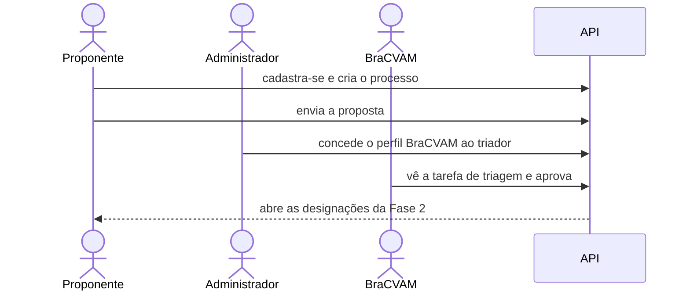

# Do cadastro à triagem

Neste tutorial você acompanha a primeira etapa de uma validação: alguém propõe
um método, o BraCVAM avalia se a proposta é admissível e, se for, o processo
segue para a montagem da equipe do estudo.



## Os personagens

- **Proponente**: quem tem um método alternativo e quer validá-lo. Qualquer
  pessoa cadastrada pode propor.
- **Administrador**: cuida das contas e dos acessos da plataforma.
- **Triador do BraCVAM**: analisa as propostas e decide se seguem adiante.

## 1. Preparar o ambiente

Antes de tudo, a plataforma precisa estar no ar com os perfis, os modelos de
processo e uma conta de administrador. Isso é feito uma vez só.

??? example "Como fazer"
    No `.env`, use a IA de teste e defina o administrador:

    ```bash
    cp .env.example .env
    ```

    ```bash
    AI_PROVIDER="fake"
    INITIAL_ADMIN_EMAIL="admin@example.com"
    INITIAL_ADMIN_PASSWORD="admin-senha-123"
    ```

    Suba o banco, prepare a plataforma e inicie a API:

    ```bash
    docker compose up db -d
    poetry install
    poetry run alembic upgrade head
    poetry run python -m pivma.bootstrap_system
    poetry run poe serve
    ```

    Com uv, troque `poetry install` por `uv sync` e `poetry run` por `uv run`.
    Em outro terminal, defina o endereço e uma função de login (precisa de
    `curl` e `jq`):

    ```bash
    API=http://localhost:8000
    login() {
      curl -s -X POST $API/auth/login -H 'Content-Type: application/json' \
        -d "{\"identifier\":\"$1\",\"password\":\"$2\"}" | jq -r .access_token
    }
    ```

## 2. O proponente e o triador criam suas contas

Os dois se cadastram como qualquer usuário. Nenhum deles tem, ainda, um papel
especial: o que cada um pode fazer depende do que acontece a seguir.

??? example "Como fazer pela API"
    ```bash
    for u in proponente triador; do
      curl -s -X POST $API/users -H 'Content-Type: application/json' \
        -d "{\"username\":\"$u\",\"email\":\"$u@example.com\",\"full_name\":\"Usuário $u\",\"password\":\"senha-segura-123\"}"
    done
    ```

## 3. O proponente abre um processo

O proponente escolhe o tipo de validação que quer (método pré-validado, prova
de conceito, extensão de escopo…) e dá um título ao processo. Ao criar, ele
passa a ser o **proponente** desse processo e recebe a primeira tarefa:
preencher a proposta, com prazo de 7 dias.

??? example "Como fazer pela API"
    ```bash
    PROP=$(login proponente senha-segura-123)
    PID=$(curl -s -X POST $API/processes -H "Authorization: Bearer $PROP" \
      -H 'Content-Type: application/json' \
      -d '{"template_key":"pre_validated_method","title":"Método 3T3 NRU"}' | jq -r .id)
    curl -s "$API/tasks?process_id=$PID&status=READY" -H "Authorization: Bearer $PROP" \
      | jq '.data[] | {activity_key, due_date}'
    ```

    A tarefa listada é `proposal_submission`.

## 4. O proponente envia a proposta

O proponente pode salvar o formulário como rascunho quantas vezes quiser.
Quando envia, a proposta fica travada para edição e vai para análise.

Se o BraCVAM tivesse configurado critérios de IA para esse formulário, a IA
leria a proposta antes. Como não há critérios, ela vai direto para a triagem.

??? example "Como fazer pela API"
    ```bash
    FORM=$API/processes/$PID/activities/proposal_submission/form
    curl -s -X PUT $FORM -H "Authorization: Bearer $PROP" \
      -H 'Content-Type: application/json' -d '{"values":{"method_title":"Método 3T3 NRU"}}'
    curl -s -X POST $FORM -H "Authorization: Bearer $PROP" \
      -H 'Content-Type: application/json' -d '{"values":{"method_title":"Método 3T3 NRU"}}' | jq
    ```

    A resposta traz `status: "COMPLETED"` e `pre_evaluation: null`.

## 5. O administrador dá o perfil BraCVAM ao triador

Só quem tem o perfil BraCVAM decide triagens. O administrador encontra a conta
do triador e concede o perfil.

??? example "Como fazer pela API"
    ```bash
    ADMIN=$(login admin@example.com admin-senha-123)
    TRIADOR_ID=$(curl -s "$API/users?search=triador" -H "Authorization: Bearer $ADMIN" | jq -r '.data[0].id')
    curl -s -X POST $API/rbac/users/$TRIADOR_ID/profiles/00000000-0000-0000-0000-00000000000a \
      -H "Authorization: Bearer $ADMIN" -o /dev/null -w '%{http_code}\n'
    ```

    Resposta esperada: `201`.

## 6. O triador analisa e aprova

Ao entrar, o triador vê na sua lista de pendências a triagem do novo
processo. Ele pode comentar campo a campo e, no fim, decide entre três
caminhos:

- **aprovar**: o processo segue para a próxima fase;
- **pedir revisão**: a proposta volta ao proponente com a justificativa;
- **rejeitar**: o processo é encerrado.

Aqui ele aprova.

??? example "Como fazer pela API"
    ```bash
    BRAC=$(login triador senha-segura-123)
    curl -s "$API/tasks?status=READY" -H "Authorization: Bearer $BRAC" | jq '.data[] | .activity_key'
    curl -s -X POST $API/processes/$PID/triage/reviews -H "Authorization: Bearer $BRAC" \
      -H 'Content-Type: application/json' \
      -d '{"reviews":[{"field_key":"method_title","status":"CONFORME","comments":"Claro."}]}'
    curl -s -X POST $API/processes/$PID/triage/decision -H "Authorization: Bearer $BRAC" \
      -H 'Content-Type: application/json' \
      -d '{"outcome":"APPROVED","justification":"Proposta admissível."}' | jq
    ```

## 7. O processo segue para a Fase 2

Com a triagem aprovada, o proponente recebe duas novas tarefas: indicar o
**patrocinador** e o **Grupo Gestor** do estudo. A partir daí, o Grupo Gestor
monta o resto da equipe.

Tudo o que aconteceu fica registrado na linha do tempo do processo. Cada
pessoa vê só a parte que lhe diz respeito: o proponente vê a criação e o envio,
mas não os comentários internos da triagem.

??? example "Como fazer pela API"
    ```bash
    curl -s "$API/tasks?process_id=$PID&status=READY" -H "Authorization: Bearer $PROP" \
      | jq '.data[] | .activity_key'
    curl -s $API/processes/$PID/timeline -H "Authorization: Bearer $PROP" | jq '.data[] | .event_type'
    ```

    Tarefas: `assign_sponsor` e `assign_group_manager`.

## O que você viu

- Quem cria um processo vira o proponente dele.
- Cada etapa aparece como uma tarefa para quem deve agir.
- O perfil BraCVAM é o que permite decidir a triagem.
- A aprovação abre a fase seguinte; cada pessoa só vê o que lhe cabe.

Para entender o fluxo completo, leia [Modelo de processo](../explicacao/modelo-de-processo.md).
