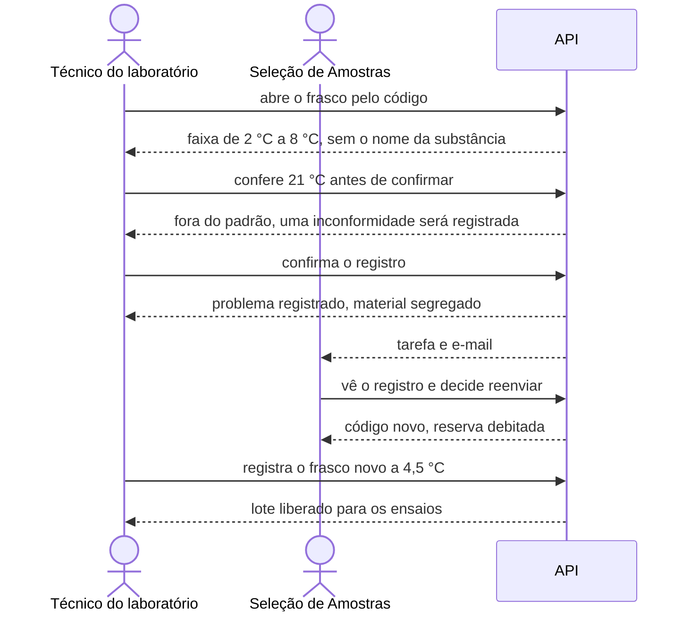

# Quando um frasco chega com problema

As amostras saíram da seleção e chegaram ao laboratório. Neste tutorial o
frasco chega quente: o gelo derreteu no frete. O técnico registra o problema,
a seleção de amostras é avisada e manda outro frasco, e o técnico recebe o
novo em ordem.



## Os personagens

- **Técnico do laboratório**: abre a caixa térmica, mede a temperatura e
  registra cada frasco. Não sabe o que há dentro.
- **Seleção de Amostras**: conhece as substâncias, guarda frascos de reserva
  e decide o que fazer com um frasco com problema.

## Antes de começar

Faça o tutorial [Montar a equipe e preparar as amostras](equipe-e-amostras.md)
inteiro. Ele termina com a definição das amostras concluída: uma substância
refrigerada, com um frasco de reserva, e um laboratório.

??? example "Como fazer pela API"
    ```bash
    TEC=$(login tecnico senha-segura-123)
    SEL=$(login selecao senha-segura-123)
    PID=$(curl -s "$API/processes" -H "Authorization: Bearer $SEL" \
      | jq -r '.data[] | select(.title=="Método 3T3 NRU") | .id')
    ```

## 1. O técnico vê o que tem a receber

O técnico tem uma tarefa nova: a confirmação de recebimento. Ele vê o frasco
do laboratório dele, ainda pendente, e lê pelo código como conservá-lo. A
tela mostra a faixa de temperatura e os pictogramas de perigo. O nome da
substância não aparece.

??? example "Como fazer pela API"
    ```bash
    curl -s "$API/tasks?process_id=$PID&status=READY" -H "Authorization: Bearer $TEC" \
      | jq '.data[] | .activity_key'
    CODE=$(curl -s $API/processes/$PID/sample-receipt/vials -H "Authorization: Bearer $TEC" \
      | jq -r '.data[0].code')
    curl -s $API/processes/$PID/samples/vials/$CODE -H "Authorization: Bearer $TEC" \
      | jq '{code, storage_temperature_min, storage_temperature_max, ghs_hazard_pictograms}'
    ```

    A tarefa é `sample_receipt`; a faixa vai de `2.0` a `8.0`.

## 2. O técnico registra o frasco quente

O termômetro marca 21 °C. O técnico preenche a temperatura, diz que a
embalagem está íntegra e conta o que viu. Antes de confirmar, a plataforma
avisa que a condição está fora do padrão e que uma inconformidade será
registrada. Ele confirma. A plataforma não trata isso como erro: grava o
registro, avisa que o problema foi comunicado e pede que o material fique
separado. O recebimento do laboratório fica esperando.

??? example "Como fazer pela API"
    ```bash
    curl -s -X POST $API/processes/$PID/sample-receipt/vials/$CODE/check \
      -H "Authorization: Bearer $TEC" -H 'Content-Type: application/json' \
      -d "{\"opened_at\":\"$(date -u +%Y-%m-%dT%H:%M:%SZ)\",\"temperature_celsius\":21.0,
           \"package_state\":\"intact\"}" | jq -r .message
    curl -s -X POST $API/processes/$PID/sample-receipt/vials/$CODE \
      -H "Authorization: Bearer $TEC" -H 'Content-Type: application/json' \
      -d "{\"opened_at\":\"$(date -u +%Y-%m-%dT%H:%M:%SZ)\",\"temperature_celsius\":21.0,
           \"package_state\":\"intact\",\"notes\":\"Gelo totalmente fundido durante o frete.\"}" \
      | jq '{conforming, deviations, laboratory_receipt_status, message}'
    ```

    `conforming` é `false`, `deviations` traz `temperature_out_of_range` e o
    lote está `awaiting_decision`.

## 3. A seleção de amostras vê o problema

A responsável pela seleção recebe a tarefa "Resolver problemas no recebimento
de amostras" e, se o envio de e-mail estiver configurado, um e-mail com o
laboratório e o código. Na plataforma ela vê o alerta ("Alerta de
Recebimento: o laboratório ... registrou desvio térmico no frasco ..."), a
temperatura medida, a faixa esperada, a observação do técnico e quantos
frascos ainda tem de reserva.

??? example "Como fazer pela API"
    ```bash
    curl -s "$API/tasks?process_id=$PID&status=READY" -H "Authorization: Bearer $SEL" \
      | jq '.data[] | .activity_key'
    NC=$(curl -s "$API/processes/$PID/sample-receipt/nonconformities?status=open" \
      -H "Authorization: Bearer $SEL")
    echo $NC | jq '.data[0] | {alert, code, deviations, receipt: .receipt.temperature_celsius,
      expected_temperature, reserve: .substance.reserve_vials_count}'
    NC_ID=$(echo $NC | jq -r '.data[0].id')
    ```

## 4. A seleção manda outro frasco

Ela decide reenviar e explica por quê. A plataforma tira um frasco da
reserva e gera um código novo, para que o técnico não associe o frasco novo
ao que chegou quente. Ela imprime a etiqueta nova e despacha. A tarefa dela
se fecha.

??? example "Como fazer pela API"
    ```bash
    NEW=$(curl -s -X POST $API/processes/$PID/sample-receipt/nonconformities/$NC_ID/decision \
      -H "Authorization: Bearer $SEL" -H 'Content-Type: application/json' \
      -d '{"decision":"resend","justification":"Frasco reserva despachado."}' \
      | jq -r .replacement_code)
    curl -s $API/processes/$PID/samples/labels -H "Authorization: Bearer $SEL" \
      | jq '.data[] | .code'
    ```

    A etiqueta listada é a do código novo.

## 5. O técnico recebe o frasco novo

Para o técnico, o frasco antigo aparece como substituído e há um frasco
pendente com outro código. Nada liga um ao outro, nem a justificativa da
seleção aparece. Ele registra o novo a 4,5 °C e o lote fecha: a amostra está
na cadeia de custódia e liberada para os ensaios.

??? example "Como fazer pela API"
    ```bash
    curl -s $API/processes/$PID/sample-receipt/vials -H "Authorization: Bearer $TEC" \
      | jq '.data[] | {code, status}'
    curl -s -X POST $API/processes/$PID/sample-receipt/vials/$NEW \
      -H "Authorization: Bearer $TEC" -H 'Content-Type: application/json' \
      -d "{\"opened_at\":\"$(date -u +%Y-%m-%dT%H:%M:%SZ)\",\"temperature_celsius\":4.5,
           \"package_state\":\"intact\"}" \
      | jq '{laboratory_receipt_status, message}'
    ```

    O lote fica `completed`.

## O que você viu

- O laboratório só vê os próprios frascos, sem identidade química.
- Um frasco fora de ordem não trava ninguém em silêncio: a seleção recebe a
  tarefa na mesma hora.
- O laboratório não segue para os ensaios com o lote incompleto.
- O reenvio troca o código e gasta a reserva; só a seleção vê qual código
  substituiu qual.

Mais detalhes: [Receber amostras](../guias/receber-amostras.md) e
[Amostras cegas](../explicacao/amostras-cegas.md).
