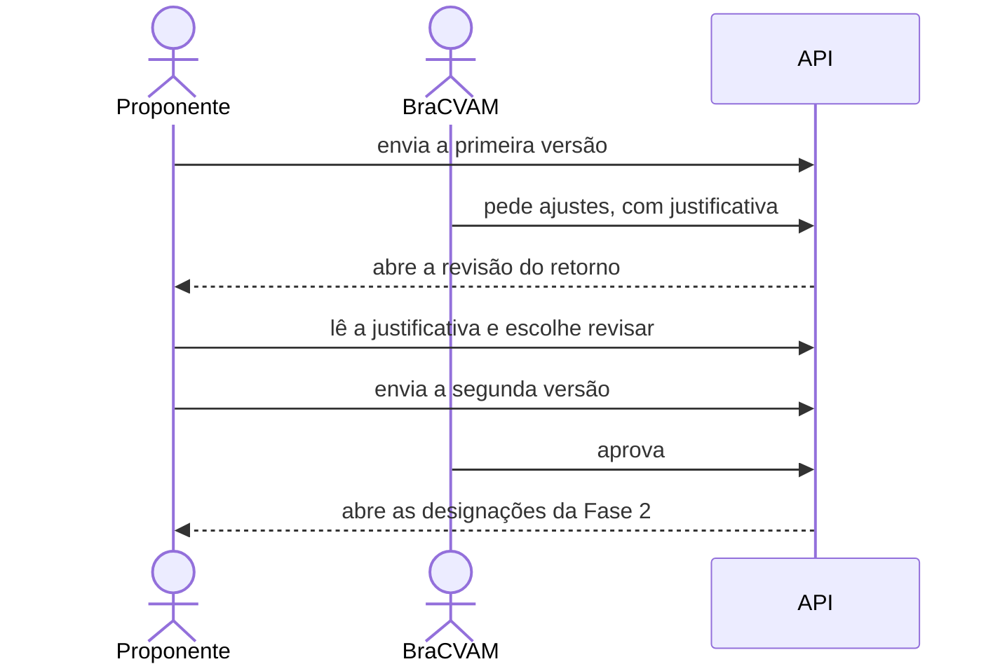

# Quando a triagem pede ajustes

Nem toda proposta chega pronta. Neste tutorial o triador encontra uma lacuna e
pede ajustes; o proponente lê o motivo, corrige e reenvia; a nova versão é
aprovada. Nada se perde: a versão devolvida fica guardada.



## Os personagens

- **Proponente**: dono da proposta.
- **Triador do BraCVAM**: quem analisa e decide.

## Antes de começar

Faça o tutorial [Do cadastro à triagem](primeiro-processo.md) até o passo 5.
Você vai reaproveitar o ambiente, a função `login` e as contas `proponente` e
`triador` (já com o perfil BraCVAM).

## 1. O proponente envia uma proposta incompleta

O proponente abre um novo processo e envia a primeira versão.

??? example "Como fazer pela API"
    ```bash
    PROP=$(login proponente senha-segura-123)
    PID=$(curl -s -X POST $API/processes -H "Authorization: Bearer $PROP" \
      -H 'Content-Type: application/json' \
      -d '{"template_key":"pre_validated_method","title":"Ensaio RhCE"}' | jq -r .id)
    FORM=$API/processes/$PID/activities/proposal_submission/form
    curl -s -X POST $FORM -H "Authorization: Bearer $PROP" \
      -H 'Content-Type: application/json' -d '{"values":{"method_title":"Ensaio RhCE"}}' | jq .run_number
    ```

    A resposta mostra `1`: é a primeira versão.

## 2. O triador pede ajustes

O triador percebe que faltam os controles do ensaio. Em vez de rejeitar, ele
**pede revisão** e explica o que falta. A justificativa é obrigatória, porque
é ela que orienta o proponente.

??? example "Como fazer pela API"
    ```bash
    BRAC=$(login triador senha-segura-123)
    curl -s -X POST $API/processes/$PID/triage/decision -H "Authorization: Bearer $BRAC" \
      -H 'Content-Type: application/json' \
      -d '{"outcome":"NEEDS_REVISION","justification":"Faltam os controles positivo e negativo."}' \
      | jq '{outcome, return_review_run}'
    ```

    `return_review_run: 1` indica que o retorno foi aberto para o proponente.

## 3. O proponente lê o retorno

O proponente recebe uma nova tarefa: responder ao retorno. Ao abri-la, ele vê
de onde veio a devolução (a triagem), a justificativa e o que pode fazer:

- **revisar**: reabrir a proposta para corrigir;
- **desistir**: encerrar o processo.

Enquanto ele não escolhe, a proposta continua travada.

??? example "Como fazer pela API"
    ```bash
    curl -s "$API/tasks?process_id=$PID&status=READY" -H "Authorization: Bearer $PROP" \
      | jq '.data[] | .activity_key'
    curl -s $API/processes/$PID/return-review -H "Authorization: Bearer $PROP" \
      | jq '{source, justificativa: .triage_decision.justification, available_choices}'
    ```

    A tarefa é `submission_return_review`, e a origem é `TRIAGE`.

## 4. O proponente revisa e reenvia

Ao escolher revisar, a proposta reabre já preenchida com o que ele tinha
enviado. Ele completa o que faltava e envia de novo. Esta é a segunda versão.

??? example "Como fazer pela API"
    ```bash
    curl -s -X POST $API/processes/$PID/return-review -H "Authorization: Bearer $PROP" \
      -H 'Content-Type: application/json' -d '{"choice":"REVISE"}' | jq
    curl -s -X POST $FORM -H "Authorization: Bearer $PROP" \
      -H 'Content-Type: application/json' \
      -d '{"values":{"method_title":"Ensaio RhCE com controles positivo e negativo"}}' | jq .run_number
    ```

    A resposta mostra `2`.

## 5. O triador aprova a nova versão

A triagem volta para a lista do triador. Desta vez, ele aprova.

??? example "Como fazer pela API"
    ```bash
    curl -s -X POST $API/processes/$PID/triage/decision -H "Authorization: Bearer $BRAC" \
      -H 'Content-Type: application/json' \
      -d '{"outcome":"APPROVED","justification":"Controles incluídos."}' | jq .process_status
    ```

    O processo segue `OPEN`, agora na Fase 2.

## 6. A versão devolvida fica guardada

A primeira versão não se perde. O histórico da proposta guarda cada versão
devolvida, com o conteúdo enviado e a justificativa da devolução. A versão
atual é a que está no formulário. Assim dá para comparar o que mudou entre o
pedido de ajuste e a aprovação.

??? example "Como fazer pela API"
    ```bash
    curl -s $API/processes/$PID/submission-versions -H "Authorization: Bearer $PROP" \
      | jq '.data[] | {run_number, title, return_justification}'
    curl -s $FORM -H "Authorization: Bearer $PROP" | jq .values
    ```

    O histórico mostra a versão `1`, com a justificativa da triagem. O
    formulário mostra os valores da versão `2`.

## O que você viu

- Pedir revisão não encerra o processo: devolve a proposta com uma explicação.
- O proponente decide o que fazer com o retorno; a escolha vale uma vez.
- Cada reenvio é uma nova versão, e as devolvidas continuam disponíveis.

Mais detalhes: [Responder ao retorno](../guias/responder-ao-retorno.md).
