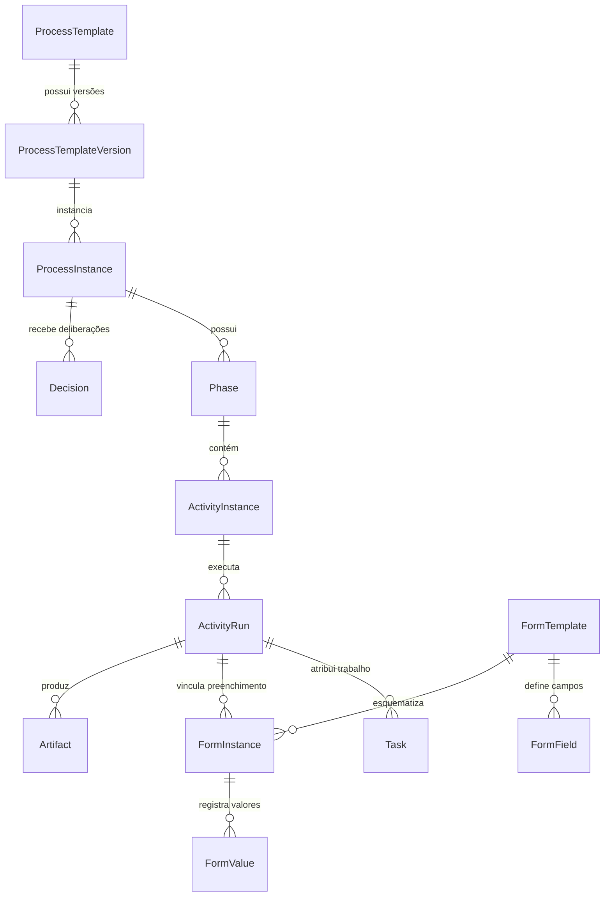
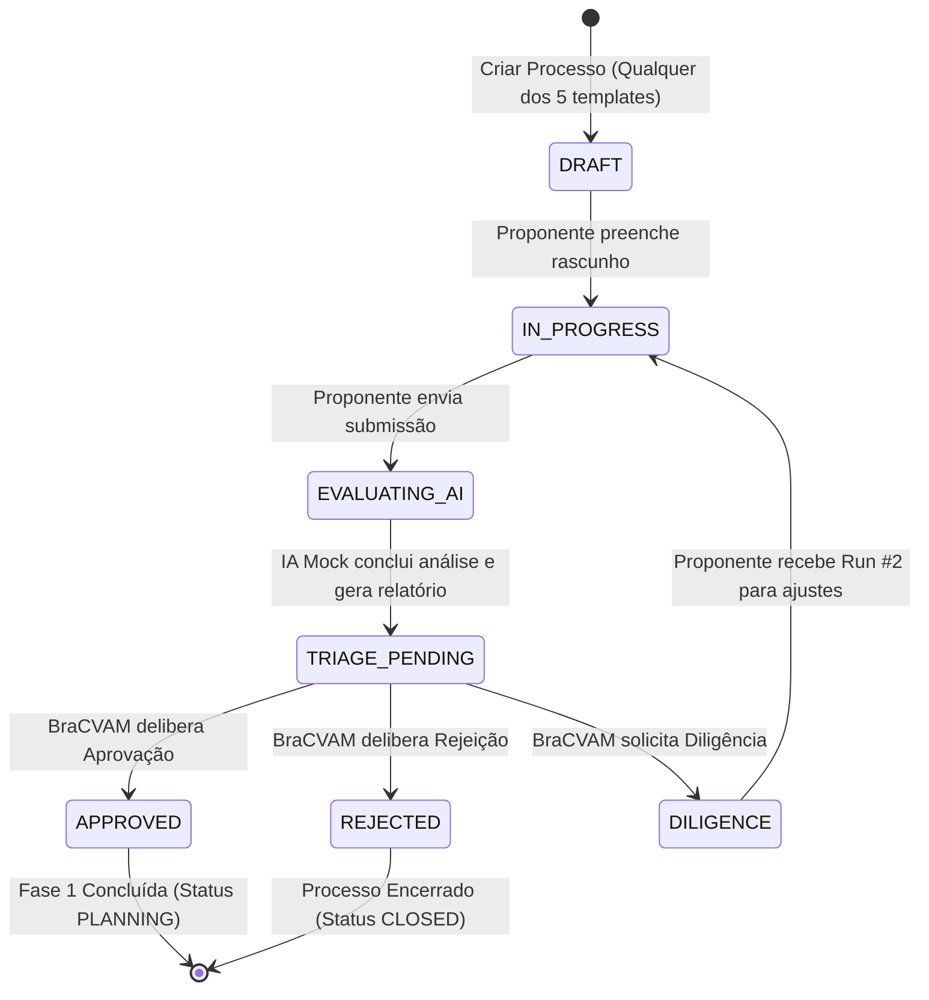

# Data Model: 011 - Processos Padrão do Sistema (5 Pipelines Oficiais)

**Feature**: `011-standard-process-templates`
**Date**: 2026-09-09

---

## 1. Visão Geral das Entidades

A feature 011 reaproveita o modelo de dados unificado do motor de processos introduzido na Feature 004 e expandido na Feature 010, sem necessidade de alterações estruturais em tabelas de banco de dados (schema DDL). O foco é a **especificação declarativa de templates, formulários e integração de instâncias**.

---

## 2. Entidades Declarativas (Templates & Formulários)

### 2.1 ProcessTemplate
Representa cada um dos 5 processos oficiais disponibilizados pelo BraCVAM.

| Campo | Tipo | Descrição |
|---|---|---|
| `id` | UUID | Identificador primário único |
| `key` | VARCHAR(64) UNIQUE | Chave semântica do processo (`pre_validated_method`, `scope_extension`, `me_too_validation`, `validated_method_dossier`, `proof_of_concept`) |
| `name` | VARCHAR(255) | Nome de exibição oficial do processo |
| `description` | TEXT | Enquadramento regulatório e escopo de maturidade do método |
| `is_active` | BOOLEAN | Status ativo/inativo para instanciação |

### 2.2 ProcessTemplateVersion
Versionamento da definição declarativa estruturada em YAML.

| Campo | Tipo | Descrição |
|---|---|---|
| `id` | UUID | Identificador primário único |
| `template_id` | UUID (FK) | Vínculo com o `ProcessTemplate` |
| `version_number` | INTEGER | Versão numérica sequencial (inicia em 1) |
| `definition_payload` | JSONB | Payload completo do YAML contendo fases, atividades, regras de transição e formulários |
| `is_published` | BOOLEAN | Indica se esta versão está publicada para uso |

### 2.3 FormTemplate
Esquema declarativo do formulário técnico de cada modalidade.

| Chave do Formulário (`key`) | Nome do Formulário | Processo Associado |
|---|---|---|
| `submission_pre_validated_v1` | Formulário de Submissão - Método Pré-Validado | `pre_validated_method` |
| `submission_scope_extension_v1` | Formulário de Submissão - Extensão de Escopo | `scope_extension` |
| `submission_me_too_v1` | Formulário de Submissão - Validação Me-Too | `me_too_validation` |
| `submission_validated_dossier_v1` | Formulário de Submissão - Método Validado (Dossiê) | `validated_method_dossier` |
| `submission_proof_of_concept_v1` | Formulário de Submissão - Prova de Conceito | `proof_of_concept` |
| `triage_review_v1` | Formulário de Parecer de Triagem BraCVAM | Compartilhado para a etapa de triagem |

### 2.4 FormField
Campos técnicos individuais configurados para cada formulário.

| Campo | Tipo | Descrição |
|---|---|---|
| `field_key` | VARCHAR(64) | Identificador único do campo no formulário |
| `label` | VARCHAR(255) | Rótulo exibido para o usuário |
| `field_type` | VARCHAR(32) | `text`, `textarea`, `select`, `integer`, `file_upload` |
| `is_required` | BOOLEAN | Obrigatoriedade no envio formal |
| `order_index` | INTEGER | Ordem de apresentação |
| `ai_evaluation_enabled` | BOOLEAN | Flag que habilita o pipeline de IA da Feature 010 |
| `ai_context_instructions` | TEXT | Instruções regulatórias/científicas para a IA |
| `ai_validation_rules` | JSONB | Regras de validação analítica (ex.: `min_length`) |

---

## 3. Entidades Operacionais e de Ciclo de Vida

### 3.1 ProcessInstance
Instância de processo em execução gerada para uma submissão.

- `code`: Código institucional único no formato `VAL-{ANO}-{HEX8}` (ex.: `VAL-2026-a1b2c3d4`).
- `status`: Estados permitidos na Fase 1:
  - `SUBMISSION`: Proponente elaborando ou revisando (após diligência).
  - `TRIAGE`: Submetido, avaliado pela IA e em análise pelo BraCVAM.
  - `PLANNING`: Aprovado na triagem do BraCVAM.
  - `CLOSED`: Rejeitado e arquivado na triagem.

### 3.2 ActivityInstance & ActivityRun
- **Atividade 1**: `proposal_submission` (Ordem 1)
  - Papel: `PROPONENT`
  - Dependências: Nenhuma
  - Formulário: Específico de cada template (`submission_*_v1`)
- **Atividade 2**: `triage_evaluation` (Ordem 2)
  - Papel: `TRIAGE_LEAD` (Membro do BraCVAM)
  - Dependências: `proposal_submission` com status `COMPLETED`
  - Formulário: `triage_review_v1`

### 3.3 Artifact
Artefatos imutáveis gerados durante o fluxo:
- `proposal_dossier`: Criado na submissão com os dados completos fornecidos pelo proponente.
- `ai_evaluation_report`: Criado pelo motor de IA simulado contendo o veredito, inconformidades e recomendações.
- `triage_opinion`: Criado na deliberação pelo triador do BraCVAM com o parecer formal.

---

## 4. Máquina de Estados da Fase 1

