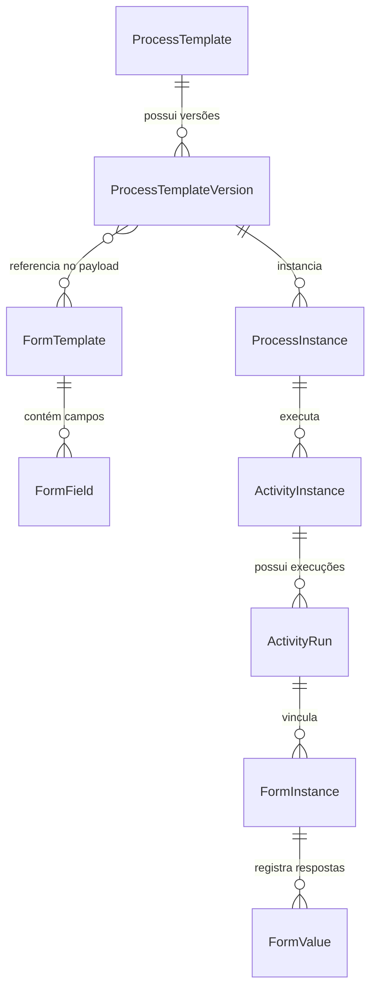

# Data Model: Editor e Customização de Templates de Formulários (Versão 1.1)

## Entidades e Relacionamentos



---

## Modelos de Dados e Esquemas

### 1. `ProcessTemplate` (Tabela: `process_templates`)
Representa a modalidade de validação no catálogo do sistema.
- `id: UUID` (PK)
- `key: String(64)` (Unique, ex: `pre_validated_method`)
- `name: String(255)`
- `description: Text`
- `is_active: Boolean`
- `created_at / updated_at / deleted_at`

### 2. `ProcessTemplateVersion` (Tabela: `process_template_versions`)
Representa a versão publicada do pipeline de processos e formulários.
- `id: UUID` (PK)
- `template_id: UUID` (FK -> `process_templates.id`)
- `version_number: Integer`
- `definition_payload: JSONB` (Contém estrutura de fases, atividades e definições completas de formulários e campos)
- `is_published: Boolean`

### 3. `FormTemplate` (Tabela: `form_templates`)
Representa o esquema declarativo de um formulário de coleta.
- `id: UUID` (PK)
- `key: String(64)` (Unique, ex: `submission_pre_validated_v1`)
- `name: String(255)`
- `version: Integer`
- `description: Text | None`
- `fields: relationship[FormField]`

### 4. `FormField` (Tabela: `form_fields`)
Representa cada campo configurável de um formulário.
- `id: UUID` (PK)
- `form_template_id: UUID` (FK -> `form_templates.id`)
- `field_key: String(64)` (Chave técnica única no escopo do formulário)
- `label: String(255)` (Rótulo visível)
- `field_type: String(32)` (`text`, `textarea`, `select`, `integer`, `float`, `boolean`, `date`, `file_upload`)
- `help_text: Text | None` (Texto de ajuda / descrição para preenchimento)
- `is_required: Boolean` (Indica obrigatoriedade)
- `order_index: Integer` (Posicionamento ordinal)
- `options: JSONB | None` (Lista de opções para campos `select`)
- `validation_rules: JSONB | None` (Regras de validação, limites e atributo de seção `{"section": "..."}`)
- `ai_evaluation_enabled: Boolean` (Spec 010: Flag de análise por IA)
- `ai_context_instructions: Text | None` (Instruções contextuais para o modelo/mock de IA)
- `ai_validation_rules: JSONB | None` (Critérios de validação de IA)

---

## Esquemas de Requisição e Resposta (Pydantic / DTOs)

### `UpdateFormTemplateRequest`
```python
class FormFieldUpdateDefinition(BaseModel):
    field_key: str
    label: str
    help_text: str | None = None
    field_type: str = 'text'
    is_required: bool = False
    order_index: int = 0
    section: str | None = 'Geral'
    options: list[Any] | None = None
    validation_rules: dict[str, Any] | None = None
    ai_evaluation_enabled: bool = False
    ai_context_instructions: str | None = None
    ai_validation_rules: dict[str, Any] | None = None


class UpdateFormTemplateRequest(BaseModel):
    name: str | None = None
    description: str | None = None
    fields: list[FormFieldUpdateDefinition]
```

### `FormTemplateDetailResponse`
```python
class FormTemplateDetailResponse(BaseModel):
    id: UUID
    key: str
    name: str
    version: int
    description: str | None
    fields: list[FormFieldUpdateDefinition]
```
